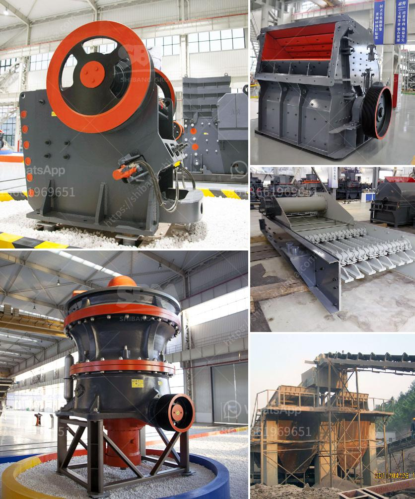

<h3>stone jaw crushers in japan</h3>
Stone jaw crushers are an essential piece of equipment in the mining and construction industry. They are primarily used to crush large rocks into smaller particles for further processing in various industries. With Japan being one of the leading countries in the global industrial sector, stone jaw crushers are in high demand.

Japan has always been at the forefront of technological advancements, and its stone jaw crushers reflect this innovation. The country's machinery sector is known for its precision engineering, durability, and reliability. Stone jaw crushers manufactured in Japan provide high-quality materials and are known for their robust construction, ensuring long-lasting performance.

One of the key advantages of stone jaw crushers is their versatility. They can be used for various applications, including recycling concrete and asphalt, crushing and screening rock, quarrying, and mining operations. Stone jaw crushers in Japan are designed to handle various types of materials, such as granite, limestone, basalt, and even river stones.

These crushers are equipped with durable and heavy-duty components, making them suitable for the toughest work environments. Additionally, their advanced automation features allow for efficient and precise control of the crushing process, ensuring optimal performance and productivity.

The Japanese stone jaw crushers market is highly competitive, with several renowned manufacturers offering a wide range of models and specifications to cater to different customer requirements. These crushers come in various sizes and capacities, allowing users to select the most suitable model for their specific needs.

Furthermore, the after-sales service provided by Japanese stone jaw crusher manufacturers is exceptional. They offer comprehensive support, including installation, training, and maintenance guidance, ensuring hassle-free operation and prolonging the lifespan of the equipment.

In conclusion, stone jaw crushers in Japan offer reliable and efficient crushing solutions for various industries. With their technological advancements, precision engineering, and robust construction, these crushers are suitable for handling a wide range of materials in tough work environments. Whether it is quarrying, mining, or recycling applications, stone jaw crushers from Japan are highly sought after for their quality, durability, and performance.
<h3>Contact us</h3><ul><li><strong>Whatsapp:&nbsp;<a href="https://wa.me/8613661969651">+8613661969651</a></strong></li><li><a href="https://swt.shibang-china.com/?git&amp;zhl&amp;stone jaw crushers in japan"><strong>Online Service(chat now)</strong></a></li></ul><h3>Related</h3><ul><li><a href='contribution of quarrying in nigeria economy.md'>contribution of quarrying in nigeria economy</a></li><li><a href='stone crushers in ethiopia.md'>stone crushers in ethiopia</a></li><li><a href='impact crushers manufacture.md'>impact crushers manufacture</a></li><li><a href='i am looking for a stone crusher in malaysia.md'>i am looking for a stone crusher in malaysia</a></li><li><a href='spare parts for a jaw crusher.md'>spare parts for a jaw crusher</a></li></ul>