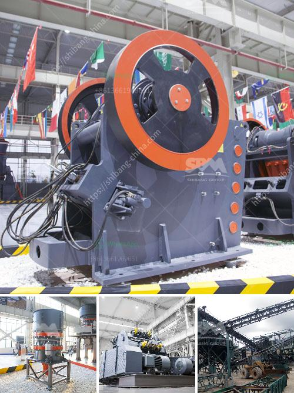

<h3>stone manufacturing process</h3>
Stone has been used as a building material for thousands of years. From the pyramids of Egypt to the cathedrals of Europe, stone has played a crucial role in architectural design. But have you ever wondered how stone is manufactured? In this article, we will take a closer look at the stone manufacturing process, from quarrying to the finished product.

1. Quarrying: The process begins with the extraction of stone from a quarry. Quarrying methods vary depending on the type of stone and its location, but it typically involves stripping away overburden (soil, vegetation, etc.) to expose the stone bed. Explosives or heavy machinery may be used to loosen the stone from the earth. Once the stone is detached from the quarry, it is transported to the manufacturing facility.

2. Cutting and Shaping: At the manufacturing facility, the rough stone blocks are cut into slabs of the desired thickness using saws or specialized cutting equipment. This is typically done using diamond-tipped blades or wires, which are capable of cutting through even the toughest stones. The slabs are then further cut and shaped into the desired dimensions and finishes, whether it is for countertops, tiles, or other architectural elements.

3. Surface Treatment: Depending on the desired finish, the stone may undergo various surface treatments. These treatments can include polishing, honing, or brushing to achieve a smooth and refined appearance. Polishing is a mechanical process that uses abrasives to achieve a glossy finish, while honing creates a matte or satin finish. Brushing, on the other hand, uses brushes or abrasive tools to create a textured finish.

4. Sealing and Enhancing: Stone is a porous material, which means it can absorb liquids and stains. To protect the stone from damage and discoloration, it is often sealed with a protective sealer. This sealer helps to repel liquids and prevent staining. In some cases, the stone may also be enhanced with color-enhancing treatments, which bring out the natural beauty and color variations of the stone.

5. Quality Control: Throughout the manufacturing process, strict quality control measures are put in place to ensure the finished product meets the highest standards. This includes inspecting the stone for imperfections, ensuring the dimensions and finishes are accurate, and conducting various tests to ensure the stone is strong, durable, and resistant to environmental factors.

6. Packaging and Shipping: Once the stone has passed quality control, it is carefully packaged to prevent any damage during transportation. This can include wrapping the slabs or tiles in protective materials, such as foam or plastic, and packaging them in crates or pallets. The stone is then shipped to distributors, retailers, or directly to the customer.

From the labor-intensive quarrying process to the precision cutting and shaping, the stone manufacturing process requires a great deal of skill and expertise. Whether it is granite, marble, limestone, or any other type of stone, each step in the manufacturing process plays a crucial role in creating the final product.

So, the next time you admire a beautifully crafted stone countertop or a stunning stone sculpture, take a moment to appreciate the intricate journey that the stone has gone through, from the quarry to the finished product.
<h3>Contact us</h3><ul><li><strong>Whatsapp:&nbsp;<a href="https://wa.me/8613661969651">+8613661969651</a></strong></li><li><a href="https://swt.shibang-china.com/?git&amp;zhl&amp;stone manufacturing process"><strong>Online Service(chat now)</strong></a></li></ul><h3>Related</h3><ul><li><a href='stone crusher bahan bakar.md'>stone crusher bahan bakar</a></li><li><a href='project report on quartz industries.md'>project report on quartz industries</a></li><li><a href='sand washing plant 50 ton day.md'>sand washing plant 50 ton day</a></li><li><a href='quarry crusher manufacturer.md'>quarry crusher manufacturer</a></li><li><a href='crushing plant design and layout considerations.md'>crushing plant design and layout considerations</a></li></ul>