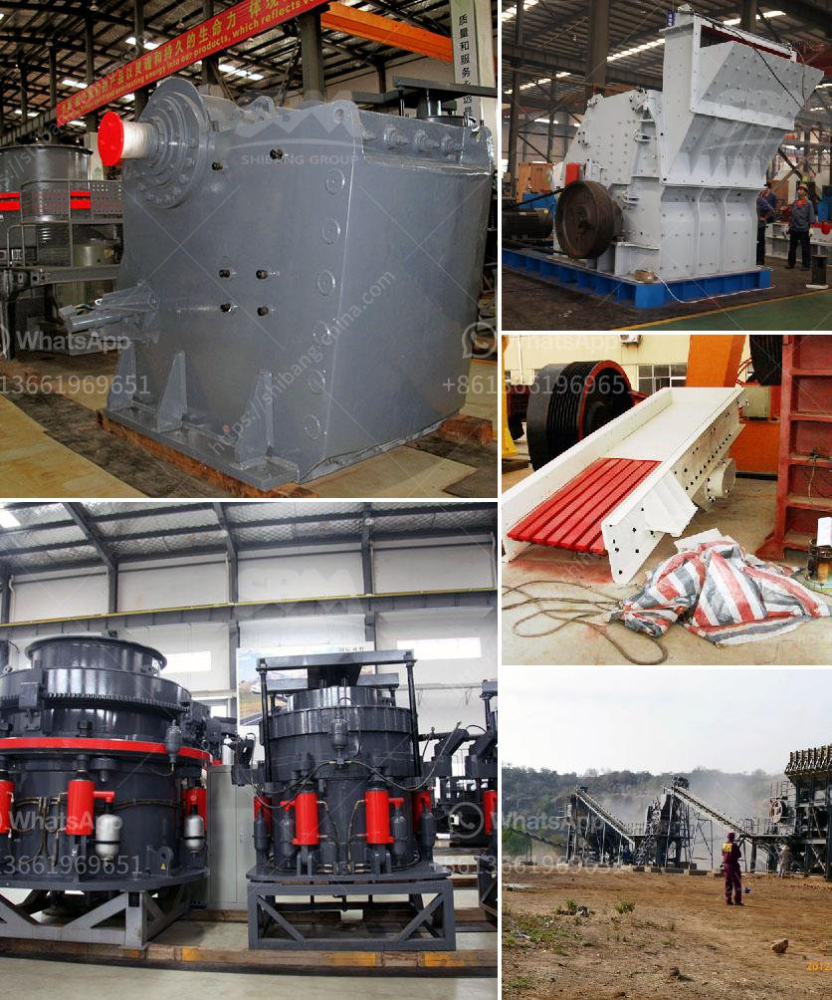

<h3>stone mill hammer mill</h3>
Grinding grains has been a fundamental part of human civilization for centuries. From ancient times to modern society, grains have been a staple food source and grinding them into flour has been a crucial step in the culinary process. But with advancements in technology, different types of mills have been introduced to the market, each with its own advantages and disadvantages. Two popular options are stone mills and hammer mills. In this article, we will delve into the characteristics and benefits of both to help you determine which one is better suited for your grinding needs.

A stone mill, as the name suggests, is a mill that uses stone as the grinding mechanism. This type of mill is ideal for medium to coarse-grained grains, such as corn, wheat, and barley. The grinding process involves two stones, one stationary and the other rotating. The grain is fed into the gap between the stones, where it is crushed and ground into flour. Stone mills have been used for centuries and are known for their durability and the high-quality flour they produce.

On the other hand, a hammer mill is a mill that utilizes a series of hammers to crush and grind grains into a powder. Hammer mills are primarily used for applications requiring a fine to medium-sized output. The grinding process is achieved by the collision of the rotating hammers against the grain. Hammer mills are known for their versatility and ability to produce a wide range of particle sizes.

When comparing stone mills and hammer mills, several factors need to be considered. Firstly, stone mills are generally more expensive than hammer mills. The cost of the materials used in the construction of stone mills, such as granite or quartz, can significantly drive up the price. Hammer mills, on the other hand, are often less expensive due to their simpler design and lower manufacturing costs.

Secondly, stone mills tend to produce a finer grind compared to hammer mills. The slow rotational speed of the stones in a stone mill allows for effective grinding without overexposing the grains to heat, preserving their nutrients and flavor. Hammer mills, however, can generate heat during the grinding process, potentially leading to a loss of nutritional value.

Another distinguishing feature is the maintenance requirements. Stone mills are generally low maintenance machines that require occasional cleaning and stone replacement after extended use. Hammer mills, on the other hand, may require more frequent maintenance due to the wearing of the hammers and screens. Replacement parts for hammer mills are readily available, making maintenance a relatively straightforward task.

Lastly, the final product texture may differ. Stone mills are known for producing flour with a slightly coarser texture, which some bakers prefer for rustic bread and other artisanal products. Hammer mills, on the other hand, can produce a finer flour suitable for applications such as cake baking and pastry making.

In conclusion, both stone mills and hammer mills have their own merits and drawbacks. Stone mills excel in durability, producing high-quality flour, and low maintenance requirements. Hammer mills, on the other hand, are more versatile, cost-effective, and can produce a wider range of particle sizes. Ultimately, the choice between the two depends on your specific needs and preferences. Whether you opt for the traditional charm of a stone mill or the efficiency of a hammer mill, grinding grains is a timeless culinary tradition that continues to evolve with the times.
<h3>Contact us</h3><ul><li><strong>Whatsapp:&nbsp;<a href="https://wa.me/8613661969651">+8613661969651</a></strong></li><li><a href="https://swt.shibang-china.com/?git&amp;zhl&amp;stone mill hammer mill"><strong>Online Service(chat now)</strong></a></li></ul><h3>Related</h3><ul><li><a href='gold mining machinery.md'>gold mining machinery</a></li><li><a href='marble quarry business plan.md'>marble quarry business plan</a></li><li><a href='used quarry equipment for sale in calgary canada.md'>used quarry equipment for sale in calgary canada</a></li><li><a href='china coal crusher high capacity.md'>china coal crusher high capacity</a></li><li><a href='price of plant crusher in nigeria.md'>price of plant crusher in nigeria</a></li></ul>