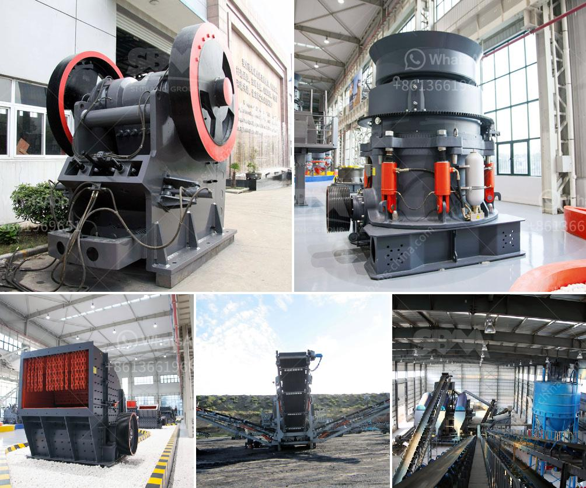

<h3>stone paper production machine</h3>
Stone paper is an innovative and eco-friendly alternative to traditional paper made from wood pulp. It is a type of paper that is manufactured using calcium carbonate, a compound found abundantly in nature, and small amounts of HDPE (high-density polyethylene) resin. The production of stone paper involves the use of a specialized machine that transforms limestone into a thin, durable, and water-resistant material.

The stone paper production machine is a complex piece of machinery that consists of various components working together to produce the final product. The process begins with the feeding of limestone rocks into the machine's crushing chamber where they are broken down into smaller fragments. These fragments are then ground into a fine powder, which is mixed with water to form a slurry.

The slurry is then sent through a series of screens and filters to remove impurities and ensure the smoothness of the paper's surface. Once the slurry is clean and uniform, it is fed into a specialized extrusion machine, where it is heated and forced through a die. The die imparts the desired shape and thickness to the paper and is an essential component in determining the final characteristics of the stone paper.

As the extruded paper sheet comes out of the die, it is cooled using a series of rollers or cooling systems to achieve the desired water-resistant properties. The stone paper production machine also includes a coating unit, where a thin layer of HDPE resin is applied to improve the paper's durability and ensure its resistance to tearing and water damage.

The entire production process is highly automated and requires minimal human intervention. However, it is essential to maintain the machine's efficiency by regularly monitoring its operation and conducting routine maintenance checks. This includes inspecting the machine's components, lubricating moving parts, and ensuring that all safety features are functioning correctly.

One of the significant advantages of using a stone paper production machine is its environmentally friendly nature. Unlike traditional paper production, which involves the cutting down of trees and the use of harsh chemicals, stone paper is made from readily available limestone and requires minimal water and energy. Additionally, it generates no waste or harmful by-products during the manufacturing process.

Another advantage is the exceptional qualities of stone paper. It is tear-resistant, waterproof, and can withstand extreme temperatures, making it an ideal choice for a range of applications. Stone paper is commonly used in packaging materials, books, notepads, and even wallpaper due to its durability and water-resistant properties.

In conclusion, the stone paper production machine is a remarkable invention that has revolutionized the paper industry. It offers a sustainable and eco-friendly alternative to conventional paper made from wood pulp, reducing the need for deforestation and minimizing environmental impact. With the growing demand for environmentally friendly products, the stone paper production machine is poised to play a crucial role in reducing carbon emissions and promoting a more sustainable future.
<h3>Contact us</h3><ul><li><strong>Whatsapp:&nbsp;<a href="https://wa.me/8613661969651">+8613661969651</a></strong></li><li><a href="https://swt.shibang-china.com/?git&amp;zhl&amp;stone paper production machine"><strong>Online Service(chat now)</strong></a></li></ul><h3>Related</h3><ul><li><a href='used stone crusher nigeria.md'>used stone crusher nigeria</a></li><li><a href='design of gravel screening and washing plant.md'>design of gravel screening and washing plant</a></li><li><a href='jaw crusher ghana quarry plant.md'>jaw crusher ghana quarry plant</a></li><li><a href='cone crusher for sale in philippines.md'>cone crusher for sale in philippines</a></li><li><a href='china dahua series jaw crusher.md'>china dahua series jaw crusher</a></li></ul>