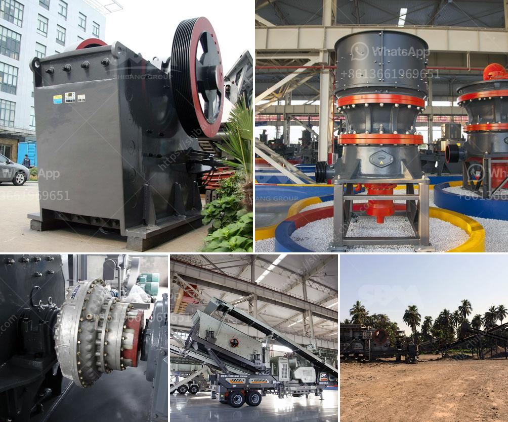

<h3>stone quarry companies in ghana</h3>
Stone quarrying is a booming industry in Ghana, the country is rich in natural resources such as granite, limestone, marble, and sandstone that are essential materials for the construction industry. With the growing demand for these materials, there are several stone quarry companies operating in the country that contribute significantly to the local economy.

One of the notable stone quarry companies in Ghana is Cedar Quarry Ghana Limited. This company is a privately-owned company that is involved in the production and supply of construction materials to the construction industry in Ghana. The company is based in Kumasi with a site at Tanoso in the Ashanti Region.

Cedar Quarry Ghana Limited utilizes state-of-the-art equipment to produce high-quality aggregates, including gravel, rock dust, and sand used for projects in Ghana and neighboring West African countries. The company operates a state-of-the-art crushing plant and equipment at its quarry site with, a capacity of 250 tonnes per hour.

The company also operates a stone cutting and fabrication plant aimed at supplying granite and other stones to meet the increasing demand for these materials. The stone cutting and fabrication plant supplies cut and polished stone products for the local market and for export to countries within the West African sub-region.

Stone quarrying in Ghana has huge benefits and as such, governments have put in place several measures to facilitate the growth of the industry. One of such measures is the sustainable quarry management system, which entails the identification and mapping of quarry zones, regulation of blasting activities, and the establishment of monitoring systems to ensure compliance with environmental standards.

Stone quarry companies in Ghana not only provide construction materials but also increase employment options. The country is home to skilled technicians and artisans who are trained in various aspects of the industry. These individuals are employed by the stone quarry companies to work on the extraction, cutting, polishing, and transportation of these stones.

In conclusion, stone quarry companies in Ghana are vital players in the construction industry and contribute significantly to the economic development of the country. These companies have also helped to provide employment opportunities for many Ghanaians. With the growing demand for their products and the government's commitment to sustainable quarry management, the industry is expected to thrive in the coming years.
<h3>Contact us</h3><ul><li><strong>Whatsapp:&nbsp;<a href="https://wa.me/8613661969651">+8613661969651</a></strong></li><li><a href="https://swt.shibang-china.com/?git&amp;zhl&amp;stone quarry companies in ghana"><strong>Online Service(chat now)</strong></a></li></ul><h3>Related</h3><ul><li><a href='ball mill in wait of ball.md'>ball mill in wait of ball</a></li><li><a href='ball mill vs vertical roller mill pdf.md'>ball mill vs vertical roller mill pdf</a></li><li><a href='stone crusher aggregate supplier kota.md'>stone crusher aggregate supplier kota</a></li><li><a href='used raymond mills barite raymond mill.md'>used raymond mills barite raymond mill</a></li><li><a href='malaysia conveyor belts.md'>malaysia conveyor belts</a></li></ul>