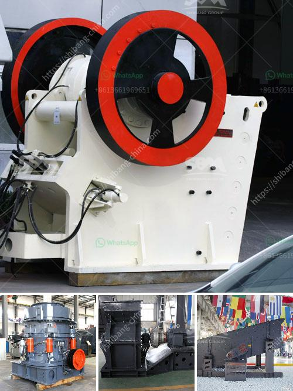

<h3>stone quarry crusher in kasoa</h3>
The stone quarry crusher in Kasoa plays a significant role in the construction industry. The Kasoa region, located in the central part of Ghana, is known for its booming construction activities. The demand for raw materials such as sand, gravel, and crushed stones is continuously increasing due to the rapid urbanization and infrastructure development happening in the region. The stone quarry crusher in Kasoa provides a reliable source of quality materials for construction projects.

One of the main advantages of the stone quarry crusher is its affordability. Compared to other sources of construction materials, the quarry crusher offers a cost-effective solution for contractors, builders, and individuals involved in construction activities. The quarry crusher can produce various sizes of crushed stones, depending on the specific requirements of the project. This versatility allows construction companies to use the crushed stones for different purposes, such as road base, concrete production, and building foundations.

Furthermore, the stone quarry crusher in Kasoa promotes local employment opportunities. With the expansion of the construction industry, the demand for labor also increases. The quarry crusher provides job opportunities for the local community, ranging from machine operators, loaders, and truck drivers, to administrative personnel and maintenance staff. This form of employment contributes to the economic development of the region by reducing unemployment rates and providing income to the local workforce.

In addition to economic benefits, the stone quarry crusher also has environmental advantages. The quarry operates within strict regulations and guidelines to mitigate any negative impacts on the surrounding environment. Measures such as dust control systems, noise reduction techniques, and water management strategies are implemented to ensure sustainable operations. The quarry crusher also promotes responsible mining practices, ensuring the rehabilitation and reclamation of land after extraction.

Furthermore, the stone quarry crusher in Kasoa contributes to local infrastructure development. The quarry provides a direct source of construction materials for projects in the vicinity. This reduces transportation costs and dependency on external sources, leading to improved efficiency and convenience in construction operations. The availability of high-quality materials from the quarry enhances the durability and longevity of the built structures, ultimately benefiting the community.

Despite the numerous benefits provided by the stone quarry crusher in Kasoa, it is essential to address potential challenges and concerns. Measures such as monitoring air and water quality, regular maintenance of equipment, and proper waste management practices should be implemented to minimize any adverse effects. Collaboration between the quarry operators, local authorities, and community stakeholders is crucial to ensure sustainable development and address any issues arising from the quarry's operations.

To conclude, the stone quarry crusher in Kasoa plays a crucial role in the construction industry and the development of the region. It offers affordable construction materials, creates employment opportunities, supports local infrastructure projects, and promotes responsible mining practices. With proper management and collaboration, the quarry crusher can continue to be a vital industry for the growth and prosperity of Kasoa.
<h3>Contact us</h3><ul><li><strong>Whatsapp:&nbsp;<a href="https://wa.me/8613661969651">+8613661969651</a></strong></li><li><a href="https://swt.shibang-china.com/?git&amp;zhl&amp;stone quarry crusher in kasoa"><strong>Online Service(chat now)</strong></a></li></ul><h3>Related</h3><ul><li><a href='price of plants crushing.md'>price of plants crushing</a></li><li><a href='standard operating procedure for coal pulverizer.md'>standard operating procedure for coal pulverizer</a></li><li><a href='chromite ore processing in zimbabwe.md'>chromite ore processing in zimbabwe</a></li><li><a href='concrete crusher price philippines.md'>concrete crusher price philippines</a></li><li><a href='pulverizer for carbon black.md'>pulverizer for carbon black</a></li></ul>