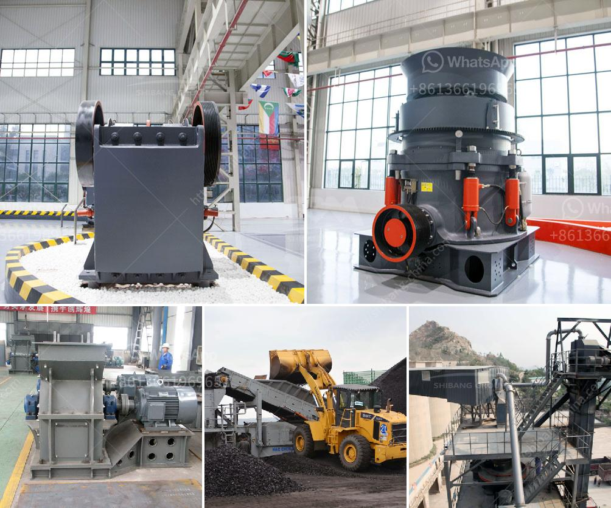

<h3>supplier of granite crusher</h3>
Granite is a common type of igneous rock that is granular in texture. It is extracted from quarries all over the world and processed into various forms for different uses, such as countertops, flooring, and gravestones. To convert granite into usable crushed stone, crushed granite, or granite crusher, is required.

A granite crusher is a crucial step in the granite quarrying process, as it helps break down the large rocks into smaller manageable pieces. These smaller pieces are then used for various applications, including construction, landscaping, and manufacturing.

One of the essential factors in the production of high-quality granite crusher is finding a reliable supplier. A reliable supplier ensures that the granite crusher is of superior quality, meets industry standards, and is delivered on time. Let's explore the key attributes of a reliable supplier of granite crusher.

A reliable supplier should have extensive experience in the industry and a deep understanding of the granite quarrying process. They should have a track record of successfully supplying granite crushers to various customers. Their expertise allows them to provide valuable guidance and recommendations to clients.

A reliable supplier should offer a wide range of granite crushers that cater to different customer needs. They should provide options in terms of capacity, output size, and power consumption. Additionally, they should be able to customize the granite crusher to suit specific requirements, ensuring optimal performance and efficiency.

Quality is a crucial consideration when choosing a granite crusher supplier. A reliable supplier should have stringent quality control processes in place to ensure that their crushers are of the highest quality. They should use premium-grade materials and employ advanced manufacturing techniques to produce durable and efficient granite crushers.

While quality is important, a reliable supplier should also offer competitive pricing to remain competitive in the market. They should provide transparent pricing, without compromising on the quality of the granite crusher. Customers should feel confident that they are receiving value for their investment.

Time is of the essence in any construction project, and a reliable supplier understands this. They should have a streamlined supply chain and warehousing capabilities to ensure timely delivery of granite crushers. A supplier who can deliver on time helps minimize delays and keeps projects on schedule.

A reliable supplier should provide excellent after-sales support. They should have a dedicated customer service team that is readily available to answer any queries, address concerns, or provide technical assistance. They should also offer warranty and maintenance services to ensure customer satisfaction throughout the lifespan of the granite crusher.

In conclusion, finding a reliable supplier of granite crusher is crucial for the success of any quarrying or construction project. Considering factors such as experience, expertise, variety, customization, quality assurance, competitive pricing, timely delivery, and after-sales support will help in making an informed decision. By partnering with a reliable supplier, customers can obtain a high-quality granite crusher that meets their specific requirements and contributes to the efficiency and success of their projects.
<h3>Contact us</h3><ul><li><strong>Whatsapp:&nbsp;<a href="https://wa.me/8613661969651">+8613661969651</a></strong></li><li><a href="https://swt.shibang-china.com/?git&amp;zhl&amp;supplier of granite crusher"><strong>Online Service(chat now)</strong></a></li></ul><h3>Related</h3><ul><li><a href='coal conveyor supplier from india.md'>coal conveyor supplier from india</a></li><li><a href='ball mill of small size.md'>ball mill of small size</a></li><li><a href='rudra industries ball mill manufacturers.md'>rudra industries ball mill manufacturers</a></li><li><a href='crushers of cone ethiopia.md'>crushers of cone ethiopia</a></li><li><a href='overland conveyor belt system cost estimates.md'>overland conveyor belt system cost estimates</a></li></ul>