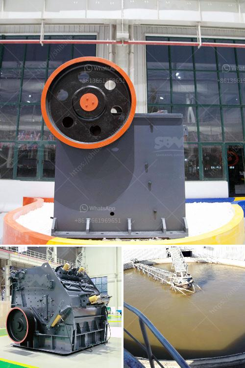

<h3>suppliers conveyor belts celaya</h3>
Conveyor belts are a crucial component in various industries, providing efficiency and productivity in the movement of materials. For businesses in Celaya, Mexico, finding reliable suppliers of conveyor belts is essential to maintain seamless operations. With a multitude of options available, it is important to carefully consider the characteristics and reputation of suppliers in order to make an informed decision.

One of the key factors to consider when selecting a supplier of conveyor belts in Celaya is the quality of their products. High-quality conveyor belts are designed to withstand heavy loads and harsh conditions, ensuring durability and longevity. It is essential to choose a supplier that offers conveyor belts made from superior materials like rubber, nylon, or steel cords. These materials provide strength and resilience, minimizing wear and tear and reducing maintenance costs in the long run.

Another important aspect to evaluate is the variety of conveyor belts offered by a supplier. Different industries have unique requirements, and a supplier should be able to cater to those diverse needs. Whether it is for mining, agriculture, manufacturing, or general transportation, it is crucial to find a supplier that can provide conveyor belts that are specifically designed for the intended application.

In addition to product quality and variety, it is essential to consider the reliability and efficiency of the supplier. Timely delivery of conveyor belts is crucial to avoid disruptions in operations. A supplier with a well-established distribution network and efficient logistics capabilities can ensure that the products are delivered as per the agreed-upon schedule. Furthermore, it is beneficial to choose a supplier with a wide inventory of conveyor belts to avoid delays caused by stock shortages.

One important aspect often overlooked is the supplier's after-sales support. Conveyor belts may require periodic maintenance, repairs, or even replacements over time. It is vital to choose a supplier that provides excellent customer service and technical assistance. This includes offering guidance on belt installation, providing training on proper usage, and promptly resolving any issues that may arise. A supplier with a dedicated support team ensures that businesses in Celaya can rely on them for ongoing assistance, maximizing the efficiency and lifespan of their conveyor belts.

When it comes to finding reliable suppliers of conveyor belts in Celaya, businesses can trust companies like Conveyor Belt Solutions. With years of experience in the industry, they offer a wide range of high-quality conveyor belts designed for various applications. Their products are manufactured using top-grade materials, ensuring durability and longevity. Conveyor Belt Solutions also takes pride in their logistics capabilities, ensuring prompt delivery and minimizing disruption to operations.

Moreover, Conveyor Belt Solutions understands the importance of exceptional customer service and technical support. They have a team of experts ready to assist businesses in Celaya, providing guidance on installation, maintenance, and repair of conveyor belts. By choosing a trusted supplier like Conveyor Belt Solutions, businesses can enhance their productivity and efficiency while minimizing downtime and operational costs.

In conclusion, selecting the right supplier of conveyor belts in Celaya is crucial for businesses to optimize their operations. Key factors to consider include product quality, variety, reliability, and after-sales support. By choosing a reputable supplier like Conveyor Belt Solutions, businesses can ensure seamless material transportation, increased productivity, and reduced maintenance costs, ultimately leading to improved profitability.
<h3>Contact us</h3><ul><li><strong>Whatsapp:&nbsp;<a href="https://wa.me/8613661969651">+8613661969651</a></strong></li><li><a href="https://swt.shibang-china.com/?git&amp;zhl&amp;suppliers conveyor belts celaya"><strong>Online Service(chat now)</strong></a></li></ul><h3>Related</h3><ul><li><a href='single stage crusher price list in south africa.md'>single stage crusher price list in south africa</a></li><li><a href='jaw crusher type sp 100 x.md'>jaw crusher type sp 100 x</a></li><li><a href='stone crusher machine philippines.md'>stone crusher machine philippines</a></li><li><a href='quartz crushing process.md'>quartz crushing process</a></li><li><a href='second hand stone production line for.md'>second hand stone production line for</a></li></ul>