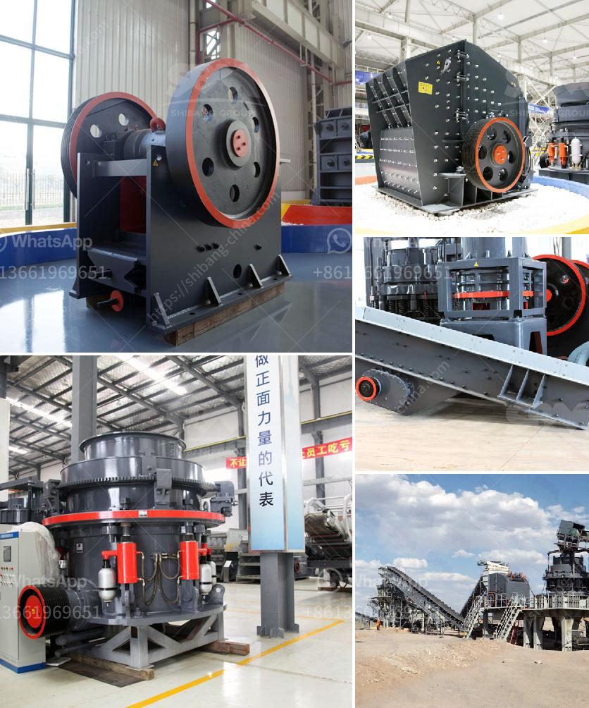

<h3>talc powder importer in europe</h3>
Talc powder has become an essential element in the beauty and skincare industry, owing to its plethora of uses. Europe, an active player in the global cosmetics market, has witnessed a significant rise in the importation of talc powder to cater to the ever-increasing demand for cosmetics.

Talc powder, derived from the mineral talc, is renowned for its ability to absorb moisture and oil, making it a common ingredient in cosmetics such as foundations, powders, and blushes. Its fine texture and natural properties have made it widely desirable among consumers. As a result, there has been a surge in the importation of talc powder in Europe.

One of the primary reasons for the increasing demand for talc powder is its versatility. It is used not only in cosmetics but also in various industrial applications, including the manufacturing of plastics, rubber, ceramics, and paint. This diversified utility has prompted importers in Europe to explore and invest in the importation of talc powder.

Talc powder importers in Europe have played a pivotal role in revolutionizing the cosmetics industry on the continent. They ensure a constant supply of quality talc powder, sourced from reliable producers worldwide, to meet the growing demands of European manufacturers. These importers strive to maintain consistent availability and facilitate smooth transactions, thereby fostering a healthy supply chain.

Moreover, talc powder importers in Europe have also contributed significantly to the continent's economy. The importation of talc powder has cultivated employment opportunities and economic growth in both exporting and importing countries. The demand for this versatile product has spurred an increase in production and employment, benefiting millions of workers globally.

Additionally, talc powder importers in Europe work tirelessly to ensure compliance with strict regulations set by the European Union. These regulations include quality control measures, packaging guidelines, and safety protocols to safeguard consumers' health. Importers maintain a strong partnership with regulatory bodies and adopt responsible sourcing practices to ensure the talc powder meets all necessary standards.

The importation of talc powder has also paved the way for innovation in the cosmetics industry in Europe. With a reliable supply of high-quality talc powder, European manufacturers can focus on developing new and improved formulations to meet the evolving demands and preferences of consumers. The presence of talc powder has sparked creativity, leading to the development of innovative cosmetic products that cater to a wide range of skin types and preferences.

Furthermore, talc powder importers in Europe have fostered global trade relationships. By sourcing talc powder from various countries, European importers establish valuable connections with international producers, thereby promoting cross-border collaboration and knowledge exchange. This exchange of ideas and expertise enhances the overall growth and sustainability of the cosmetics industry.

In conclusion, the importation of talc powder has significantly impacted the cosmetics industry in Europe. Talc powder importers ensure a steady supply of this versatile ingredient, support economic growth, and stimulate innovation. With the continuous growth in demand for cosmetics, talc powder importers in Europe play a pivotal role in meeting consumer needs and driving the industry forward.
<h3>Contact us</h3><ul><li><strong>Whatsapp:&nbsp;<a href="https://wa.me/8613661969651">+8613661969651</a></strong></li><li><a href="https://swt.shibang-china.com/?git&amp;zhl&amp;talc powder importer in europe"><strong>Online Service(chat now)</strong></a></li></ul><h3>Related</h3><ul><li><a href='coal grinding mill.md'>coal grinding mill</a></li><li><a href='cost of setting up a quarry plant.md'>cost of setting up a quarry plant</a></li><li><a href='small stone crusher machine in italy.md'>small stone crusher machine in italy</a></li><li><a href='crusher machine from south korea.md'>crusher machine from south korea</a></li><li><a href='jaw crusher and cone crusher manufacturers in dubai.md'>jaw crusher and cone crusher manufacturers in dubai</a></li></ul>