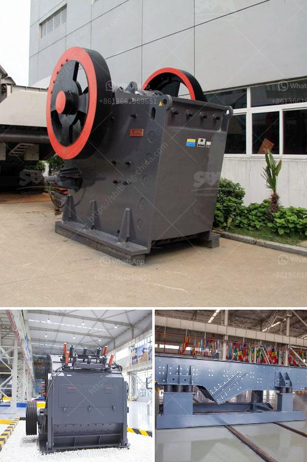

<h3>talcum powder bp usp manufacturers in india</h3>
India has emerged as a leading manufacturer of talcum powder in the global market, with a remarkable concentration of manufacturers that produce talcum powder complying with the British Pharmacopoeia (BP) and United States Pharmacopeia (USP) standards. These manufacturers adhere to stringent quality control measures to ensure the production of high-quality talcum powder that is safe for consumers.

One of the critical aspects of manufacturing talcum powder in India is the sourcing of high-quality talc minerals. India is blessed with vast reserves of talc minerals, which are carefully mined and processed to obtain pure talc for manufacturing purposes. The talc used by these manufacturers is free from any impurities or contaminants, ensuring purity and safety for application on the skin.

Furthermore, talcum powder manufacturers in India invest in state-of-the-art production facilities that employ advanced technologies to maintain consistency and uniformity in the manufacturing process. These facilities adhere to strict guidelines and regulations set by international authorities to ensure compliance with BP and USP standards. Stringent quality control checks are conducted at every stage of the manufacturing process to ensure that the talcum powder meets the required specifications.

Additionally, manufacturers in India are committed to eco-friendly practices, focusing on sustainable production and waste management. The extraction of talc minerals is carried out with minimal impact on the environment, and efforts are made to reduce carbon emissions throughout the production process. These manufacturers prioritize environmental responsibility, ensuring that their products have a minimal ecological footprint.

The talcum powder produced by BP USP manufacturers in India has gained recognition and trust from consumers worldwide. The high standards and quality assurance measures implemented by these manufacturers contribute to the reputation of Indian talcum powder as a reliable and safe choice.

In conclusion, the talcum powder BP USP manufacturers in India have set high standards for quality assurance and manufacturing practices. Their commitment to sourcing high-quality talc minerals, investing in modern production facilities, and adhering to strict regulations ensures that the talcum powder produced is safe, pure, and compliant with international standards. As a result, India has become a trusted global supplier of talcum powder, catering to the needs of both domestic and international markets.
<h3>Contact us</h3><ul><li><strong>Whatsapp:&nbsp;<a href="https://wa.me/8613661969651">+8613661969651</a></strong></li><li><a href="https://swt.shibang-china.com/?git&amp;zhl&amp;talcum powder bp usp manufacturers in india"><strong>Online Service(chat now)</strong></a></li></ul><h3>Related</h3><ul><li><a href='mtw trapezium mill.md'>mtw trapezium mill</a></li><li><a href='stone crusher dubai for sale.md'>stone crusher dubai for sale</a></li><li><a href='industrial mining jaw crushers south africa.md'>industrial mining jaw crushers south africa</a></li><li><a href='lime powder making machine.md'>lime powder making machine</a></li><li><a href='quarry machinery manufacturers.md'>quarry machinery manufacturers</a></li></ul>