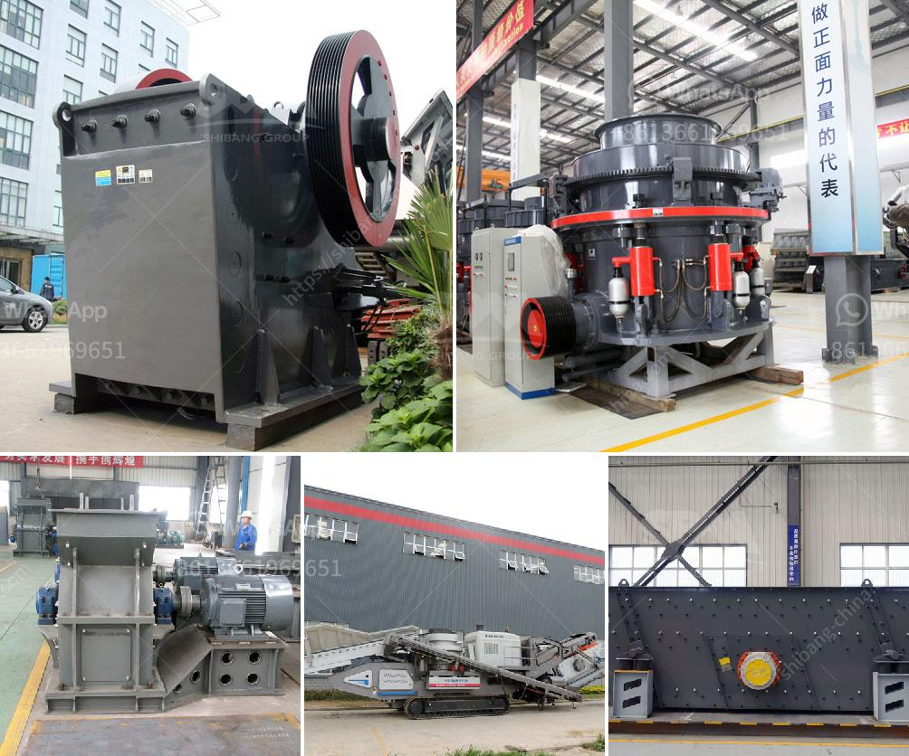

<h3>technical parametres of impact crusher</h3>
The technical parameters of an impact crusher are essential for its functionality and performance. They dictate the crushing process and overall efficiency of the equipment.

The rotor diameter plays a crucial role in an impact crusher's operation. It determines the kinetic energy imparted to the material being crushed. The length of the rotor also affects the impact force and throughput capacity.

The rotor speed defines the maximum rate at which the impact bars or hammers strike the incoming material. Proper control of the rotor speed helps optimize the crushing process, ensuring the desired particle size distribution and minimizing wear on the impact surfaces.

The maximum size of the feed material is an important parameter that impacts the capacity and efficiency of an impact crusher. Oversized material can cause blockages and increase wear, while undersized material may reduce the overall throughput.

The geometry of the crushing chamber influences the particle size distribution and shape of the crushed material. Factors like the chamber shape, size, and inclination can impact the fragmentation process and the quality of the final product.

The discharge gap between the impact aprons and the rotor determines the final crushed product's particle size. A larger gap results in coarser output, while a smaller gap produces finer particles. Adjusting the discharge gap allows for versatility in the final product specifications.

The power rating of an impact crusher determines the crushing capacity and productivity. It indicates the amount of energy required to crush a given quantity of material per unit time. A higher power rating generally translates into higher production rates.

The hardness and abrasiveness of the material being crushed influence the selection of impact crusher parts and impact surfaces. Knowing the material's properties allows for suitable wear-resistant components to be used, ensuring optimal performance and extended equipment life.

The production capacity of an impact crusher is determined by various factors such as rotor speed, feed size, and crushing chamber design. Ensuring that these parameters are well-matched and optimized results in increased output and efficiency.

The type of drive system used in an impact crusher affects its energy consumption, maintenance requirements, and overall performance. Common drive systems include direct drive, belt drive, and hydraulic drive, each with its advantages and considerations.

An impact crusher should be equipped with various safety features to protect operators and the equipment. These may include emergency stop buttons, safety guards, and automated systems to monitor and control various operational parameters.

In conclusion, understanding and optimizing the technical parameters of an impact crusher are vital for maximizing its efficiency and achieving desired crushing results. Each parameter, including rotor diameter and length, rotor speed, feed size, crushing chamber design, and power rating, must be carefully considered and adjusted to ensure optimal performance and productivity. With proper parameter selection, an impact crusher can deliver high-quality, well-shaped aggregates, making it a valuable asset in various industries.
<h3>Contact us</h3><ul><li><strong>Whatsapp:&nbsp;<a href="https://wa.me/8613661969651">+8613661969651</a></strong></li><li><a href="https://swt.shibang-china.com/?git&amp;zhl&amp;technical parametres of impact crusher"><strong>Online Service(chat now)</strong></a></li></ul><h3>Related</h3><ul><li><a href='stone crushing plants of japanese technology.md'>stone crushing plants of japanese technology</a></li><li><a href='manufacturing process of bentonite powder.md'>manufacturing process of bentonite powder</a></li><li><a href='pulverizer crusher machine manufacturers south africa.md'>pulverizer crusher machine manufacturers south africa</a></li><li><a href='100tph small capacity granite crusher.md'>100tph small capacity granite crusher</a></li><li><a href='silica sand grinding machine cost.md'>silica sand grinding machine cost</a></li></ul>