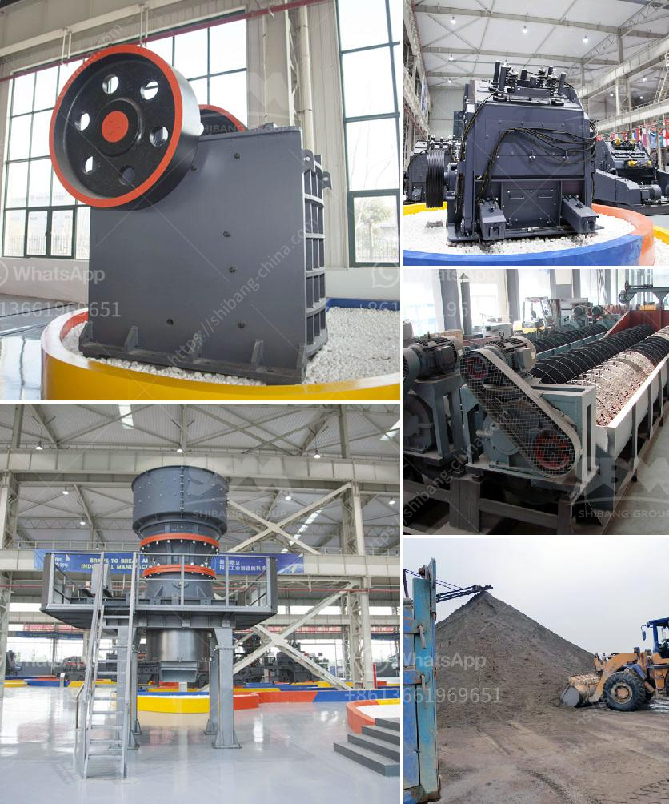

<h3>tertiary impact crushers for quartz</h3>
Quartz, widely distributed mineral of various colours, becomes a crucial raw material for industries like glass, ceramics, and cement production. Whether it is in the form of quartz sand or quartz rock, its physical and chemical properties make it a perfect choice for numerous industrial applications. However, extracting quartz from mines or natural deposits is just the first step. Proper crushing and processing are required to convert it into a usable form.

This is where tertiary impact crushers come into the picture as game-changers in the crushing industry. These machines are specifically designed to handle the hard and abrasive nature of quartz, ensuring efficient and effective reduction of particle size while maintaining excellent product shape.

Tertiary impact crushers, also known as tertiary crushers or fine crushers, are machines that utilize impact energy to crush materials. Unlike jaw crushers or cone crushers, tertiary impact crushers function through centrifugal force rather than compression. They are capable of producing finely crushed materials with a consistent grain size distribution, making them ideal for the production of quartz sand.

One of the key advantages of tertiary impact crushers is their ability to produce a high-quality cubical product. The impact crushing mechanism ensures that the finished product has a well-defined shape, minimizing the presence of flaky and elongated particles. This is particularly important for quartz, which is often used in applications where shape and consistency are critical, such as in the production of glass and ceramics.

Furthermore, tertiary impact crushers for quartz offer excellent control over the particle size distribution. Using adjustable curtains, the operator can regulate the size of the final product according to specific requirements. This level of control allows manufacturers to produce quartz with a narrow range of sizes, thus increasing its value and usability in various industrial processes.

Besides their superior performance in shaping and sizing quartz, tertiary impact crushers also offer other benefits. They are highly efficient, reducing the amount of energy required to crush quartz compared to traditional crushing methods. This results in lower operational costs and improved overall productivity.

Additionally, these crushers have a robust design that ensures their longevity and durability. Quartz, being a hard and abrasive material, requires machines that can withstand such demanding conditions. Tertiary impact crushers are built with heavy-duty components and wear-resistant materials, guaranteeing a long service life even when dealing with harsh quartz materials.

In conclusion, tertiary impact crushers are instrumental in the crushing and processing of quartz for a variety of industrial applications. Their ability to produce high-quality cubical products with controlled particle size distribution makes them an essential tool for manufacturers in the glass, ceramics, and cement industries, among others. These crushers offer unmatched efficiency, durability, and versatility, making them the preferred choice for crushing quartz. As the demand for quartz continues to grow, tertiary impact crushers are poised to play a crucial role in meeting the industry's needs while optimizing the overall performance and profitability of quartz processing operations.
<h3>Contact us</h3><ul><li><strong>Whatsapp:&nbsp;<a href="https://wa.me/8613661969651">+8613661969651</a></strong></li><li><a href="https://swt.shibang-china.com/?git&amp;zhl&amp;tertiary impact crushers for quartz"><strong>Online Service(chat now)</strong></a></li></ul><h3>Related</h3><ul><li><a href='iron crusher supplier.md'>iron crusher supplier</a></li><li><a href='sell european stone crusher.md'>sell european stone crusher</a></li><li><a href='coal conveyor supplier from india.md'>coal conveyor supplier from india</a></li><li><a href='chrome crusher machine price list.md'>chrome crusher machine price list</a></li><li><a href='contribution of quarrying in nigeria economy.md'>contribution of quarrying in nigeria economy</a></li></ul>