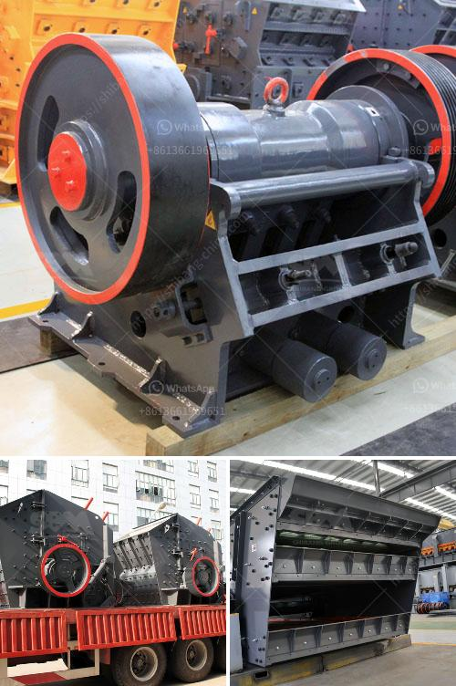

<h3>the cost to construct a cement factory</h3>
Cement factories play a crucial role in the construction industry, providing the main ingredient for the production of concrete, the most widely used construction material worldwide. Building a cement factory involves a substantial investment due to the complex and sizeable nature of the infrastructure required. In this article, we will analyze the various factors contributing to the cost of constructing a cement factory.

Selecting a suitable location for a cement factory is critical. Proximity to limestone deposits, a primary raw material for cement production, significantly impacts costs. Transportation expenses can be minimized if the factory is situated near the limestone source. Additionally, availability of water, power supply, and transportation routes should also be considered, which may require a considerable upfront investment.

The land required for establishing a cement factory can range from several acres to many hectares. The cost of acquiring the land depends on its location and availability, as well as regulatory and legal requirements in the region. Building a cement factory necessitates constructing various structures like production units, storage facilities, administrative blocks, and staff accommodations. The construction cost will depend on the size of the factory and the quality of the structures. Estimates suggest that building a cement factory can cost anywhere between $1,000 and $1,500 per square meter.

A cement factory involves the use of heavy machinery and equipment for various stages of cement production. Key machinery includes crushers, mills, kilns, belts, and dust collectors. The cost of machinery and equipment can range between $3 million and $30 million, depending on the capacity of the cement factory and available technology.

Securing a consistent and uninterrupted supply of raw materials, particularly limestone and additives like gypsum, is crucial for a cement factory. Engaging in long-term agreements with reliable suppliers is necessary to ensure stable production. The cost associated with sourcing and transporting these raw materials depends on the distance, infrastructure, and local regulations, but it typically accounts for a significant portion of the initial investment.

In recent years, environmental regulations surrounding cement production have become more stringent. Construction of a cement factory must adhere to these regulations, including air pollution control systems, wastewater treatment plants, and emissions monitoring equipment. Implementing these measures requires additional capital, pushing up the overall cost of constructing a cement factory.

Employing skilled labor and management personnel is crucial for running an efficient cement factory. Labor expenses will vary based on geographical location, labor market conditions, prevailing wages, and local labor laws. Operational costs, including power consumption, maintenance, and administrative expenses, must also be considered to accurately assess the overall cost of running a cement factory.

Building a cement factory is a mammoth investment that involves diligent planning, complying with regulatory requirements, and careful consideration of infrastructure and operational needs. The costs associated with constructing a cement factory can range from tens of millions to hundreds of millions of dollars, depending on various factors discussed above. Therefore, conducting comprehensive feasibility studies and evaluating all associated costs is vital to the success of any cement factory project.
<h3>Contact us</h3><ul><li><strong>Whatsapp:&nbsp;<a href="https://wa.me/8613661969651">+8613661969651</a></strong></li><li><a href="https://swt.shibang-china.com/?git&amp;zhl&amp;the cost to construct a cement factory"><strong>Online Service(chat now)</strong></a></li></ul><h3>Related</h3><ul><li><a href='how much is gold hammer mill crusher.md'>how much is gold hammer mill crusher</a></li><li><a href='safety poster for coal handling plant.md'>safety poster for coal handling plant</a></li><li><a href='gypsum powder line.md'>gypsum powder line</a></li><li><a href='rock crushing plants in tanzania.md'>rock crushing plants in tanzania</a></li><li><a href='marble mining countries.md'>marble mining countries</a></li></ul>