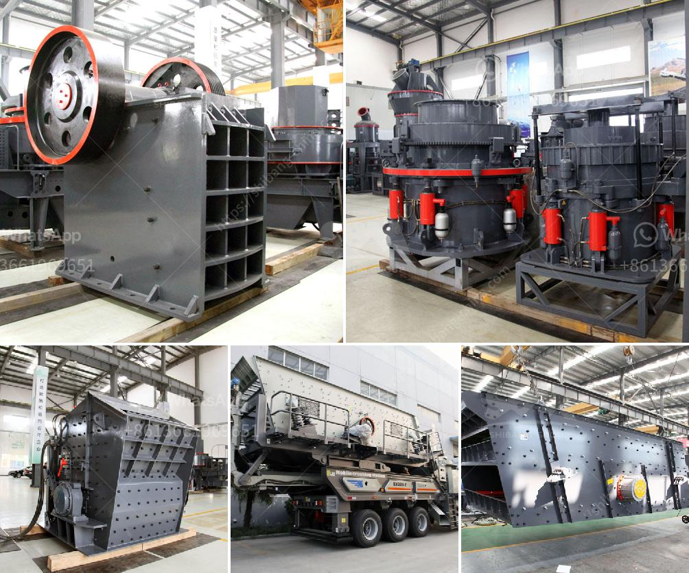

<h3>to buy gypsum calcination rotary kiln plant</h3>
Gypsum calcination rotary kiln plants are one of the many technological advancements introduced by the cement industry. These plants utilize a rotary kiln to heat raw gypsum, converting it into a plaster-forming element known as hemihydrate gypsum. This plaster can be further processed into gypsum boards, or used as a raw material in the production of cement.

If you are considering investing in a gypsum calcination rotary kiln plant, there are a few key factors to take into account. Firstly, it is important to choose a reputable supplier for your equipment. Look for manufacturers with a proven track record in producing high-quality rotary kilns and ensure that they provide comprehensive after-sales support.

The size of the plant also plays a crucial role. Depending on your specific needs, choose a plant size that is capable of producing the desired output. Plants can range from small-scale, producing a few hundred kilograms of plaster per hour, to large-scale industrial plants capable of producing several tons.

Moreover, the energy efficiency of the plant is another important consideration. Look for kilns that are designed with energy-saving features, as this will not only help reduce your carbon footprint but also result in cost savings over the long term. Some advanced kilns come equipped with heat recovery systems that recycle waste heat, further enhancing energy efficiency.

In addition, consider the overall operational costs and maintenance requirements. Opt for a plant that is easy to operate with low maintenance requirements, as this will contribute to its long-term productivity and profitability.

Lastly, don't forget to thoroughly analyze the market demand for gypsum-based products in your region. Conduct market research to determine the potential demand for gypsum plaster, gypsum boards, or cement production.

Investing in a gypsum calcination rotary kiln plant can be a lucrative venture for your business. However, it is crucial to make an informed decision based on the factors mentioned above. By choosing a reputable supplier, considering the plant size, energy efficiency, operational costs, and market demand, you can maximize your returns and ensure long-term success.
<h3>Contact us</h3><ul><li><strong>Whatsapp:&nbsp;<a href="https://wa.me/8613661969651">+8613661969651</a></strong></li><li><a href="https://swt.shibang-china.com/?git&amp;zhl&amp;to buy gypsum calcination rotary kiln plant"><strong>Online Service(chat now)</strong></a></li></ul><h3>Related</h3><ul><li><a href='lm series vertical mill.md'>lm series vertical mill</a></li><li><a href='cement processing plant.md'>cement processing plant</a></li><li><a href='ball mill grinding relation with quality pdf.md'>ball mill grinding relation with quality pdf</a></li><li><a href='stone crusher machines ebay.md'>stone crusher machines ebay</a></li><li><a href='hp cone crusher device.md'>hp cone crusher device</a></li></ul>