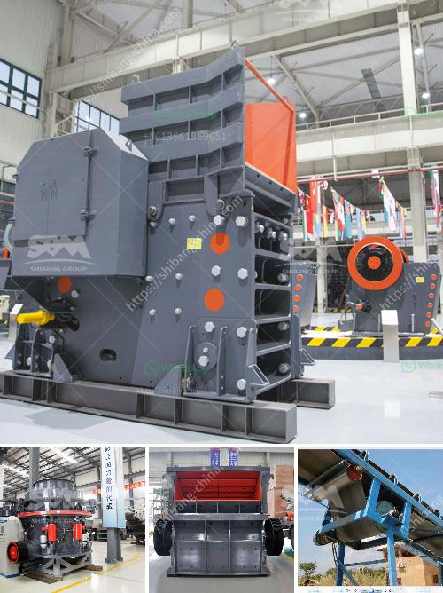

<h3>to see vibrating screens</h3>
Title: Discovering the Marvel of Vibrating Screens: A Closer Look at their Mechanics and Applications

In today's technologically advanced world, vibrating screens are a vital tool in various industries. They play a significant role in sorting, filtering, and separating different materials depending on the specific requirements of the operation. Vibrating screens have revolutionized industrial processes, making them more efficient and productive. This article will delve into the mechanics and applications of vibrating screens, explaining why they are a fundamental component in many industrial operations.

Vibrating screens, also known as sieves or screens, come in various formats to suit different applications and materials. They consist of an inclined, vibrating frame that is designed to hold a series of screening surfaces or meshes. As the screen vibrates, the different particles of the material being screened separate according to their size. This mechanical process is driven by vibrating motors, providing the necessary oscillatory motion for the screens to function effectively.

1. Sorting and Separation: Vibrating screens are widely used in the mining industry for sorting substances based on size. This is crucial for separating valuable minerals from waste material, ensuring efficient extraction and minimizing production costs.

2. Particle Classification: In chemical and pharmaceutical industries, vibrating screens help classify different types of particles, ensuring consistent quality of products. It allows for precise control over particle size distribution, ensuring products meet specific standards.

3. Solid Waste Management: Municipalities utilize vibrating screens in waste management facilities to separate recyclables from non-recyclables. The screens remove larger debris, such as plastic bottles, cans, and cardboard, allowing the sorting process to be more efficient.

4. Aggregate Processing: In the construction and aggregate industries, vibrating screens are utilized to separate and grade crushed stones, sand, and other materials. These screens efficiently separate particles based on size, ensuring the final products meet the required specifications.

1. Efficiency: Vibrating screens promote efficient material handling, reducing unnecessary production time and costs. By quickly sorting and separating materials, they optimize the workflow, increasing overall productivity.

2. Versatility: Vibrating screens are multi-purpose tools that can suit various materials. The sieves can be easily adjusted to accommodate different particle sizes and ensure accurate classification.

3. Durability: Vibrating screens are constructed with robust materials that withstand heavy usage and harsh operating conditions. This promotes longevity and reduces maintenance costs, making them highly cost-effective in the long run.

Vibrating screens have become indispensable in various industries due to their efficiency and versatility. By effectively sorting, separating, and classifying materials, vibrating screens streamline production processes, resulting in enhanced productivity and optimized workflow. Whether it's mining, chemical processing, waste management, or aggregate production, these screens play a crucial role in ensuring the quality and integrity of the final products. As technology advances, vibrating screens continue to evolve, offering even greater precision and efficiency. With such remarkable benefits, it is evident that vibrating screens are here to stay in the industrial world.
<h3>Contact us</h3><ul><li><strong>Whatsapp:&nbsp;<a href="https://wa.me/8613661969651">+8613661969651</a></strong></li><li><a href="https://swt.shibang-china.com/?git&amp;zhl&amp;to see vibrating screens"><strong>Online Service(chat now)</strong></a></li></ul><h3>Related</h3><ul><li><a href='coal sludge rotary dryer supplier india.md'>coal sludge rotary dryer supplier india</a></li><li><a href='gold mining machinery.md'>gold mining machinery</a></li><li><a href='jaw crusher for sale in spain.md'>jaw crusher for sale in spain</a></li><li><a href='stone quarry companies in ghana.md'>stone quarry companies in ghana</a></li><li><a href='cost for a metal crusher in kerala.md'>cost for a metal crusher in kerala</a></li></ul>