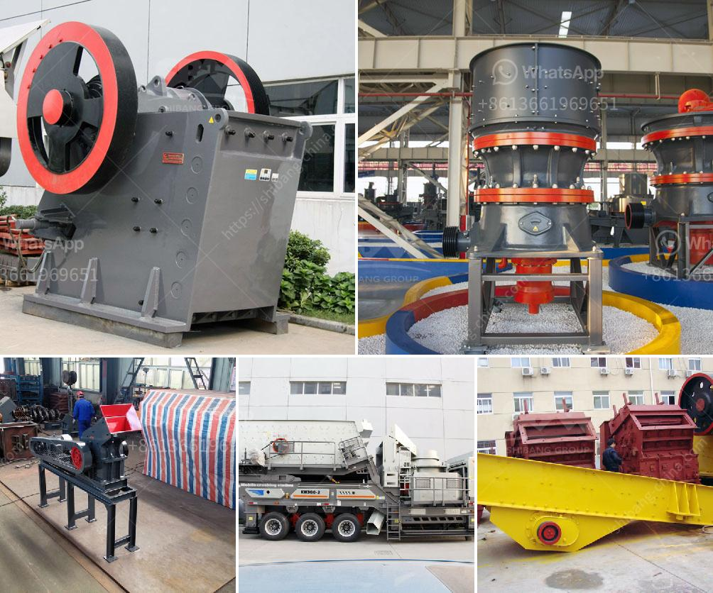

<h3>ton hour coal crusher and screen</h3>
As the world transitions towards renewable energy sources, it becomes imperative to find sustainable solutions for power generation. One such solution is the tonne hour coal crusher and screen, which has the potential to revolutionize how we utilize coal for electricity production. In this article, we will explore this innovative technology and its benefits in the context of sustainable power generation.

Coal has historically played a major role in meeting global energy demands. However, its negative environmental impact, including greenhouse gas emissions and air pollution, cannot be ignored. With the transition to a low-carbon future, the challenge lies in finding ways to harness the energy potential of coal in an environmentally responsible manner.

The tonne hour coal crusher and screen addresses this challenge by providing a flexible solution for processing coal at various capacities. With an ability to crush up to 25 tonnes of coal per hour, the crusher is an invaluable asset for coal-powered industries, such as mining operations, power plants, and quarry applications.

The tonne hour coal crusher and screen combines crushing and screening capabilities into a single unit, offering a seamless and efficient process for coal beneficiation. The crusher uses mechanical force to break large coal chunks into smaller sizes, while the screen efficiently separates coal particles based on size. This process not only optimizes coal utilization but also reduces waste and ensures the desired particle size for cleaner combustion.

1. Cleaner Energy Generation: By facilitating the extraction of finely crushed coal, the tonne hour coal crusher and screen improve combustion efficiency, resulting in reduced emissions. This technology unlocks the potential for cleaner energy generation from coal, bridging the gap until renewable energy sources can fully replace fossils fuels.

2. Reduced Environmental Footprint: The crusher and screen contribute towards reducing the environmental footprint of coal-based power generation. The efficient coal combustion process minimizes the release of pollutants into the atmosphere, curbing air pollution risks and ultimately benefiting public health and the environment.

3. Waste Minimization: By crushing coal to the desired particle size, the tonne hour coal crusher and screen minimize waste by ensuring that all coal resources are utilized effectively. This prevents unnecessary excavation and mining, reducing the environmental impact associated with coal extraction.

The tonne hour coal crusher and screen provide an innovative and sustainable solution for coal-based power generation. Its efficient and flexible design enables the extraction of coal at various capacities while minimizing emissions, optimizing coal utilization, and reducing waste. As the world strives towards sustainable energy, embracing such technologies bridges the gap between traditional coal-fired power generation and the future of renewable energy sources.
<h3>Contact us</h3><ul><li><strong>Whatsapp:&nbsp;<a href="https://wa.me/8613661969651">+8613661969651</a></strong></li><li><a href="https://swt.shibang-china.com/?git&amp;zhl&amp;ton hour coal crusher and screen"><strong>Online Service(chat now)</strong></a></li></ul><h3>Related</h3><ul><li><a href='granite rocks quarry company iyuku edo state.md'>granite rocks quarry company iyuku edo state</a></li><li><a href='slag powder grinding in india.md'>slag powder grinding in india</a></li><li><a href='magnetic separator equipment for sale.md'>magnetic separator equipment for sale</a></li><li><a href='stone mill hammer mill.md'>stone mill hammer mill</a></li><li><a href='stone crushing machines for sale.md'>stone crushing machines for sale</a></li></ul>