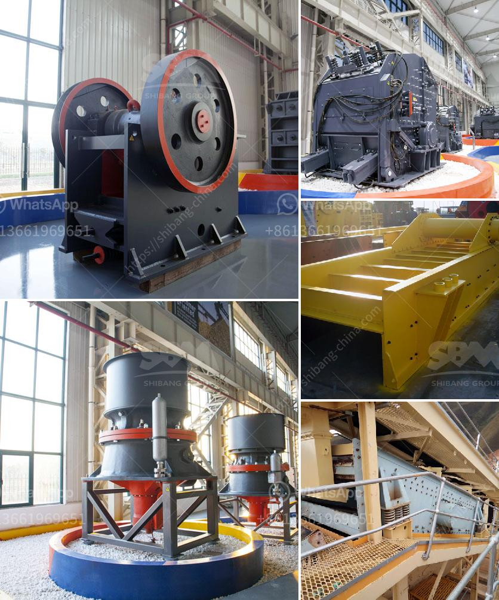

<h3>ton per hour gold wash plants</h3>
Gold mining is an industry that requires heavy machinery, high energy consumption, and significant investments. One essential piece of equipment for gold mining is the ore washing plant, which helps to extract gold particles from the earth's crust.

Ton per hour gold wash plants are highly effective machines specifically designed to wash and recover gold from alluvial deposits. These plants have the capability to process between 5 to 500 tons of material per hour. Their efficiency makes them ideal for large-scale gold mining operations.

The operation of a ton per hour gold wash plant begins with feeding the raw material into the hopper. The material is then transported along a conveyor belt or hopper to the scrubber, a rotating cylindrical drum containing water and a mix of gold particles and impurities. Inside the scrubber, water jets and paddles wash the material thoroughly, breaking it down and separating the gold particles from the rest of the sediment.

The washed material then passes through a series of screens, filters, and sluices, where the remaining impurities are removed, allowing only the valuable gold particles to continue through the process.

The recovered gold is collected in settling ponds or sluice boxes, which use a combination of gravity and water flow to separate the gold from the sediment. This process helps ensure that only high-quality gold is obtained, ready to be further processed and refined.

Ton per hour gold wash plants offer several advantages for gold miners. Firstly, they have a high processing capacity, enabling miners to work through vast quantities of material in a short amount of time. This, in turn, leads to increased gold production and profitability.

Additionally, these plants are cost-effective. They streamline the gold mining process, reducing the need for labor and decreasing operational costs. By washing the material effectively, ton per hour gold wash plants minimize the loss of gold particles, maximizing the return on investment for miners.

In conclusion, ton per hour gold wash plants are a valuable resource for the gold mining industry. Their ability to process large quantities of material efficiently and cost-effectively makes them a popular choice for miners worldwide. As the demand for gold continues to rise, these wash plants play a crucial role in meeting the industry's needs and ensuring the extraction of high-quality gold.
<h3>Contact us</h3><ul><li><strong>Whatsapp:&nbsp;<a href="https://wa.me/8613661969651">+8613661969651</a></strong></li><li><a href="https://swt.shibang-china.com/?git&amp;zhl&amp;ton per hour gold wash plants"><strong>Online Service(chat now)</strong></a></li></ul><h3>Related</h3><ul><li><a href='mining industry in mpumalanga.md'>mining industry in mpumalanga</a></li><li><a href='stone crusher machines manufactures in china.md'>stone crusher machines manufactures in china</a></li><li><a href='gold refinery equipment china.md'>gold refinery equipment china</a></li><li><a href='hammer mill machine south africa.md'>hammer mill machine south africa</a></li><li><a href='sewa rental stone crusher.md'>sewa rental stone crusher</a></li></ul>