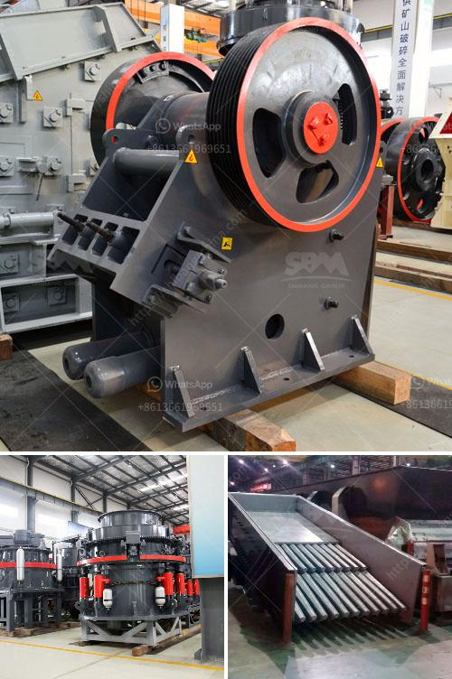

<h3>top crusher manufacturer</h3>
Crusher machines are essential equipment in mining, construction, and various other industries due to their significant impact on crushing various materials into smaller, more manageable chunks. These highly efficient machines tend to be an integral part of the material handling process in many applications. In this article, we will delve into the leading crusher manufacturers in the industry and unveil their latest innovations for construction and demolition projects.

Metso Outotec is a renowned manufacturer of mining and aggregates processing equipment, known for its high-quality crushers. They have a wide range of jaw crushers, cone crushers, impact crushers, and other machinery designed to handle the toughest materials. With their cutting-edge technology and reliability, Metso Outotec crushers are favored by construction and demolition companies globally.

Sandvik is widely recognized as a global leader in the construction equipment industry. Their jaw crushers, cone crushers, and impact crushers are designed for ruggedness, precision, and reliability. With a strong commitment to sustainable productivity, Sandvik constantly strives to deliver innovative solutions. Their crushers excel in demanding applications, such as primary crushing in mining and quarrying operations.

Terex Corporation offers a diverse range of crushing equipment for various industries. Their crushers are renowned for their superior performance, reliability, and durability. Terex's extensive range includes jaw crushers, impact crushers, and cone crushers that are capable of handling a wide variety of materials, making them highly versatile.

Thyssenkrupp is known for its world-class engineering and high-quality equipment for mining, cement, and aggregate industries. Their line of crushers exemplifies their commitment to superior performance and efficiency. Thyssenkrupp's range of jaw crushers, gyratory crushers, and cone crushers provide excellent primary crushing capabilities and can efficiently process materials with various hardness levels.

When it comes to choosing a crusher manufacturer for construction and demolition projects, these four companies stand out for their exceptional machinery. Metso Outotec, Sandvik, Terex Corporation, and Thyssenkrupp offer a diverse range of crushers that are known for their unmatched performance, durability, and reliability. From jaw crushers to cone crushers and impact crushers, their cutting-edge technology and commitment to excellence make them the top choices for any crushing application. Whether it's the toughest rocks or heavy demolition debris, these manufacturers provide efficient and robust solutions tailored to meet diverse requirements.
<h3>Contact us</h3><ul><li><strong>Whatsapp:&nbsp;<a href="https://wa.me/8613661969651">+8613661969651</a></strong></li><li><a href="https://swt.shibang-china.com/?git&amp;zhl&amp;top crusher manufacturer"><strong>Online Service(chat now)</strong></a></li></ul><h3>Related</h3><ul><li><a href='crushing equipment for rent.md'>crushing equipment for rent</a></li><li><a href='cone crusher machine for sale.md'>cone crusher machine for sale</a></li><li><a href='vertical mill for.md'>vertical mill for</a></li><li><a href='ballast quarry equipment supplies.md'>ballast quarry equipment supplies</a></li><li><a href='how to start a rock quarry business.md'>how to start a rock quarry business</a></li></ul>