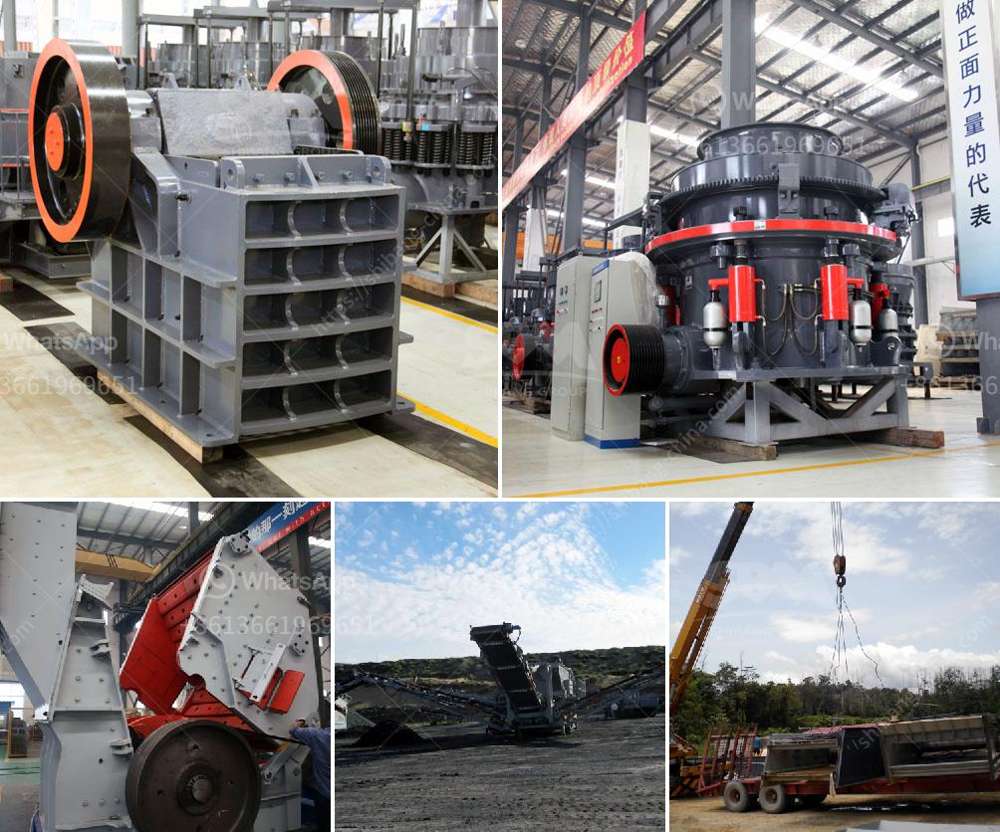

<h3>top german mining equipment manufacturers</h3>
Germany's mining equipment manufacturers have a solid reputation for delivering durable machinery that can handle the challenging demands of the global mining industry. The mining sector has been driving the economic growth of nations and has a vital role to play in propelling a country's progress. With a long history of mining expertise and engineering prowess, German manufacturers are known for producing some of the world's most advanced and efficient mining equipment.

Caterpillar, a renowned name in the mining industry, is a leading German manufacturer of heavy machinery used for mining and construction purposes. With more than 90 years of expertise, Caterpillar provides innovative solutions to mining challenges and ensures optimum operational efficiency. From excavators, loaders, and hauling trucks to drilling equipment and crushing machinery, Caterpillar consistently delivers high-quality, reliable, and sustainable solutions.

Sandvik is another prominent German mining equipment manufacturer offering a wide range of products used in the mining industry. Their equipment is specifically designed to meet the demanding requirements of underground mining and tunneling projects. Sandvik's mining equipment encompasses rock drilling tools, hydraulic breakers, conveyor belts, ventilation systems, underground trucks, and continuous mining equipment.

Liebherr is a globally recognized manufacturer of mining and construction equipment. With more than 70 years of experience, Liebherr offers an extensive range of innovative machinery for various mining applications. Liebherr's mining equipment portfolio includes hydraulic excavators, mining trucks, wheel loaders, and crawler tractors. Their commitment to engineering excellence and customer satisfaction has made them a trusted choice for the mining industry.

Komatsu Germany GmbH is a subsidiary of the Japanese multinational corporation, Komatsu Ltd. They specialize in manufacturing advanced equipment for mining purposes, including surface mining machinery, hydraulic excavators, and articulated haul trucks. Komatsu's mining equipment is known for its powerful performance, exceptional durability, and advanced technology integration.

Eickhoff Corporation is a leading German manufacturer of longwall shearers, continuous miners, and roadheaders. Their cutting-edge mining equipment is designed to maximize productivity and minimize downtime. Eickhoff's machines are renowned for their high cutting performance, reliability, and long service life.

From traditional underground mines to open-pit mines, German mining equipment manufacturers have proven their ability to meet the diverse needs of the global mining industry. Through continuous innovation, these manufacturers have consistently delivered highly efficient and reliable machinery that enhances productivity, ensures safety, and reduces environmental impacts.

With a commitment to engineering excellence, sustainable practices, and customer satisfaction, the top German mining equipment manufacturers, such as Caterpillar, Sandvik, Liebherr, Komatsu Germany GmbH, and Eickhoff Corporation, remain at the forefront of the industry. Their advanced solutions enable mining companies worldwide to optimize their operations, drive profitability, and contribute to sustainable economic development.

As the demand for minerals continues to rise, relying on established German manufacturers for high-quality mining equipment guarantees the industry's success in addressing future challenges and achieving long-term sustainability.
<h3>Contact us</h3><ul><li><strong>Whatsapp:&nbsp;<a href="https://wa.me/8613661969651">+8613661969651</a></strong></li><li><a href="https://swt.shibang-china.com/?git&amp;zhl&amp;top german mining equipment manufacturers"><strong>Online Service(chat now)</strong></a></li></ul><h3>Related</h3><ul><li><a href='coal conveyor supplier from india.md'>coal conveyor supplier from india</a></li><li><a href='used stone crushing plant for sale in spain.md'>used stone crushing plant for sale in spain</a></li><li><a href='stone crusher specification.md'>stone crusher specification</a></li><li><a href='sand screening machine in malaysia.md'>sand screening machine in malaysia</a></li><li><a href='quarry crusher mine stone.md'>quarry crusher mine stone</a></li></ul>