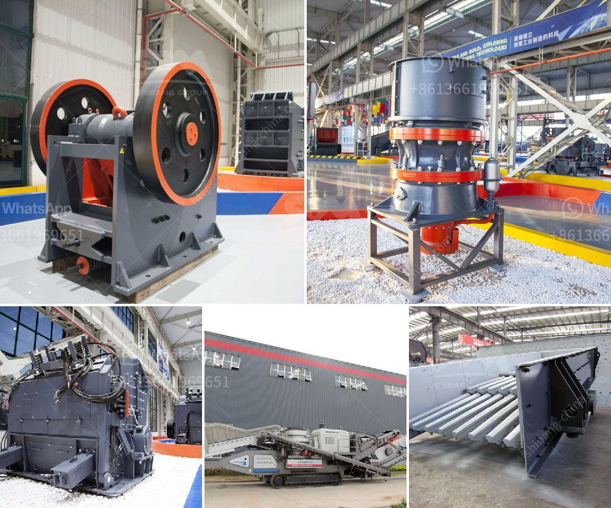

<h3>tracked mobile screening plant</h3>
Tracked mobile screening plants have revolutionized the screening process in the mining and construction industry. These plants are versatile, efficient, and highly productive, making them an essential equipment for any project requiring screening of materials such as stones, ores, and aggregates.

The key advantage of a tracked mobile screening plant is its mobility. Unlike traditional screening plants, which are stationary and require significant effort to set up and dismantle, tracked mobile plants can be easily transported to different job sites. This flexibility allows for quick and efficient screening of materials in various locations, saving both time and costs associated with transportation.

The mobility is made possible by the use of tracks, which enable the plant to move smoothly and easily over rough terrains or even in tight spaces. Tracks also ensure stability and prevent the plant from sinking in soft ground, making it ideal for use on challenging surfaces.

In addition to its mobility, a tracked mobile screening plant offers high productivity and versatility. These plants are equipped with a wide range of screening units, such as vibrating screens or trommel screens, which can efficiently separate and classify materials of different sizes. This allows for precise control over the quality of the final product, ensuring that only desired materials are used.

Furthermore, some tracked mobile screening plants can be equipped with additional features, such as a remote control system, which allows operators to adjust settings and monitor the screening process from a distance. This enhances safety and convenience, especially in hazardous or remote environments.

In conclusion, tracked mobile screening plants are a game-changer in the screening process. Their mobility, productivity, and versatility make them an invaluable asset for any project requiring efficient and precise screening of materials. With the ever-increasing demand for quality materials in various industries, these plants are set to play a crucial role in the future of mining and construction.
<h3>Contact us</h3><ul><li><strong>Whatsapp:&nbsp;<a href="https://wa.me/8613661969651">+8613661969651</a></strong></li><li><a href="https://swt.shibang-china.com/?git&amp;zhl&amp;tracked mobile screening plant"><strong>Online Service(chat now)</strong></a></li></ul><h3>Related</h3><ul><li><a href='mining process of marble crusher.md'>mining process of marble crusher</a></li><li><a href='small ball mill suppliers in sri lanka.md'>small ball mill suppliers in sri lanka</a></li><li><a href='stone crushing plant sale.md'>stone crushing plant sale</a></li><li><a href='raymond gypsum mill in india.md'>raymond gypsum mill in india</a></li><li><a href='crushing and screening plant for sale.md'>crushing and screening plant for sale</a></li></ul>