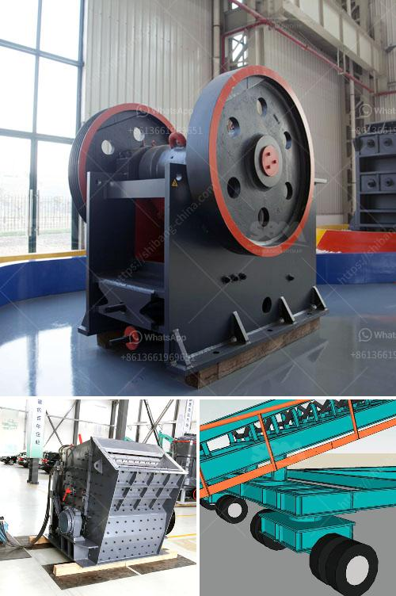

<h3>trommel wash plant suppliers pakistan</h3>
Trommel wash plants are widely used for gold mining operations around the world, including Pakistan. These plants are designed to remove larger particles and recover fine gold particles using water and gravity separation methods. In Pakistan, where gold mining is gaining popularity due to its potential for economic growth, trommel wash plant suppliers play a crucial role in providing efficient and reliable equipment for mining operations.

One of the leading trommel wash plant suppliers in Pakistan is XYZ Company. With years of experience in the industry, XYZ Company has established itself as a trusted provider of mining equipment. Their trommel wash plants are designed with advanced technology to ensure maximum gold recovery. These plants are versatile and adaptable, suitable for various mining environments.

XYZ Company takes pride in its high-quality equipment that is built to withstand the challenging conditions of gold mining. The trommel wash plants are made from durable materials and assembled with precision to ensure optimal performance and longevity. Their plants are also designed for easy maintenance, reducing downtime and increasing efficiency for mining operations.

Furthermore, XYZ Company provides comprehensive customer support, including on-site training, technical assistance, and spare parts availability. They work closely with their clients to understand their specific requirements and continually improve their products to meet evolving industry needs. With a strong commitment to customer satisfaction, XYZ Company has gained a reputation as a reliable supplier in the Pakistani gold mining industry.

In conclusion, trommel wash plant suppliers in Pakistan, such as XYZ Company, play a crucial role in supporting the growth and sustainability of the gold mining industry. Their advanced and reliable equipment helps mining operations efficiently recover gold particles, contributing to economic development. With their high-quality products, technical support, and customer-centric approach, these suppliers are instrumental in ensuring the success of mining ventures in Pakistan.
<h3>Contact us</h3><ul><li><strong>Whatsapp:&nbsp;<a href="https://wa.me/8613661969651">+8613661969651</a></strong></li><li><a href="https://swt.shibang-china.com/?git&amp;zhl&amp;trommel wash plant suppliers pakistan"><strong>Online Service(chat now)</strong></a></li></ul><h3>Related</h3><ul><li><a href='conveyor belt suppliers in lusaka.md'>conveyor belt suppliers in lusaka</a></li><li><a href='stone crusher south africa.md'>stone crusher south africa</a></li><li><a href='mining crusher plants in egypt.md'>mining crusher plants in egypt</a></li><li><a href='vibrating feeder zsw parts.md'>vibrating feeder zsw parts</a></li><li><a href='mobile cone crusher plant.md'>mobile cone crusher plant</a></li></ul>