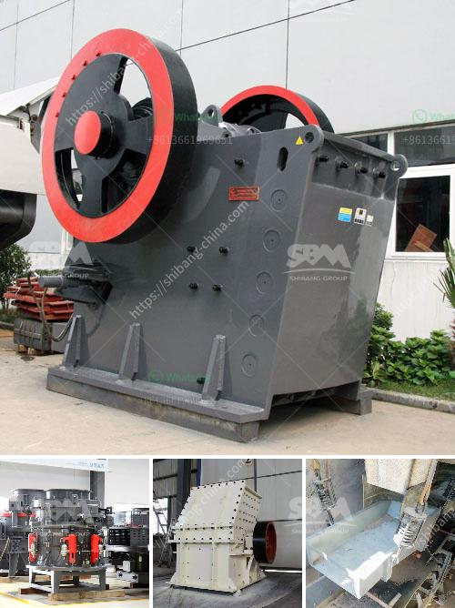

<h3>turkey stone crushers</h3>
Turkey, a country located in western Asia and southeastern Europe, is known for its rich history and diverse culture. One of the factors that has helped the country develop and progress is its natural resources. Various types of stones, such as limestone, granite, and basalt, are abundant in Turkey. These stones are essential raw materials for various industries, particularly the construction sector. Therefore, Turkey stone crushers are in high demand.

Stone crushing is necessary in order to build roads, bridges, buildings, and almost everything we need in our modern life. There are an estimated 2,000 stone crushing units in Turkey, employing over 50,000 people. These units produce crushed stones of various sizes for different construction projects. Demand for crushed stones is continuously increasing due to the country's rapid urbanization and infrastructure development.

Turkey stone crushers consist of primary and secondary crushers. These crushers work in harmony to break the stones into smaller sizes. The raw stones are first fed into the primary crusher to reduce their initial size. The primary crusher operates by pushing the stones against a stationary plate, where they are crushed and discharged. Then, the crushed stones are further processed by the secondary crusher, which has rotating hammers or bars that impact the stones and break them into smaller pieces.

Turkey stone crushers are usually equipped with a vibrating feeder, jaw crusher, and vibrating screen. These machines move the material from one level to another, in order to sort and size them before further processing. Crushers in Turkey are also available in different capacities ranging from 50 to 600 tons per hour, with feeding size up to 1,800mm.

The efficiency of turkey stone crushers has a direct impact on the profitability of the construction sector. Therefore, it is crucial to invest in high-quality crushers that can produce the required aggregate sizes efficiently. In recent years, several Turkish manufacturers have emerged as international players in the stone crushing equipment market.

One of the leading manufacturers is Fabo Machinery. With its headquarters in Izmir, Turkey, Fabo Machinery has been producing stone crushing equipment for over 20 years. Their crushers are known for their robust construction, high reliability, and excellent performance. Fabo Machinery offers a wide range of crushers, suitable for various applications, including primary, secondary, and tertiary crushing.

In conclusion, Turkey stone crushers are an important part of the construction industry. The increasing demand for crushed stones is boosting the growth of the sector, and driving the need for efficient crushers. Turkey stone crushers have high reliability and excellent performance due to their high-quality construction. Therefore, investing in a turkey stone crusher is a smart choice to ensure profitability for your business.
<h3>Contact us</h3><ul><li><strong>Whatsapp:&nbsp;<a href="https://wa.me/8613661969651">+8613661969651</a></strong></li><li><a href="https://swt.shibang-china.com/?git&amp;zhl&amp;turkey stone crushers"><strong>Online Service(chat now)</strong></a></li></ul><h3>Related</h3><ul><li><a href='trommel wash plant suppliers pakistan.md'>trommel wash plant suppliers pakistan</a></li><li><a href='ball mills sizes.md'>ball mills sizes</a></li><li><a href='how to start a robo sand machinery.md'>how to start a robo sand machinery</a></li><li><a href='sample of project proposal in mining.md'>sample of project proposal in mining</a></li><li><a href='rock crusher used in mining and quarry for sale.md'>rock crusher used in mining and quarry for sale</a></li></ul>