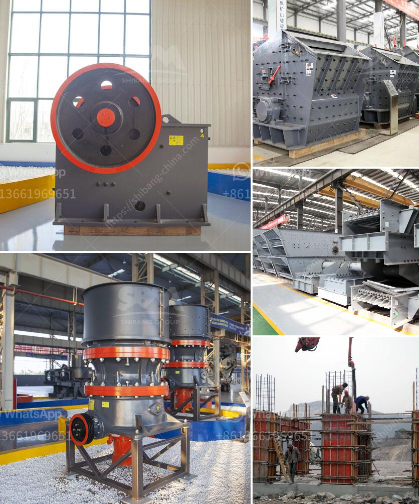

<h3>two roll mill roller price</h3>
When it comes to purchasing a two roll mill roller, finding the right balance between quality and price is crucial. Whether you are in the rubber or plastic industries, or a related field, having the right equipment is essential for achieving the desired outcomes in your production process. Let's take a closer look at the factors that influence the price of these rollers and how to find the optimal choice for your needs.

One of the primary factors determining the price of a two roll mill roller is the material used for its construction. Rollers can be made from various materials, including cast iron, stainless steel, and high-quality alloys. While cast iron rollers are more affordable, they may not offer the same durability and wear resistance as stainless steel or alloy rollers. As a result, the latter materials usually come at a higher price point. However, investing in more expensive rollers can be cost-effective in the long run, as they typically have a longer lifespan and require fewer replacements.

Another crucial consideration when evaluating the price of two roll mill rollers is the manufacturing process. Rollers produced using advanced manufacturing techniques, such as precision machining and heat treatment, tend to have higher price tags. These techniques ensure the rollers meet strict quality standards, ensuring better performance and reducing the risk of defects or failures.

Other factors that can affect the price include the size and dimensions of the roller, the quality of the surface finish, and any additional features or customizations requested. Larger rollers, with a higher diameter or length, will generally cost more due to the increased material and manufacturing requirements.

To find the best price for a two roll mill roller, it is recommended to obtain quotes from multiple suppliers. Compare the prices, but also consider the reputation and experience of the supplier in the industry. A reliable supplier can provide professional advice on which roller specifications are most suitable for your specific application, striking the perfect balance between quality and price.

In conclusion, when searching for a two roll mill roller, it is vital to carefully consider the material, manufacturing process, size, and any additional features to determine the most appropriate choice for your needs. While price is undoubtedly an important factor, it should not be the sole determining factor. Investing in high-quality rollers may require a larger upfront cost, but it can yield long-term benefits by reducing downtime, maintenance, and replacement costs. By conducting thorough research and seeking advice from reputable suppliers, you can find the perfect roller that meets your requirements without breaking the bank.
<h3>Contact us</h3><ul><li><strong>Whatsapp:&nbsp;<a href="https://wa.me/8613661969651">+8613661969651</a></strong></li><li><a href="https://swt.shibang-china.com/?git&amp;zhl&amp;two roll mill roller price"><strong>Online Service(chat now)</strong></a></li></ul><h3>Related</h3><ul><li><a href='design of gravel screening and washing plant.md'>design of gravel screening and washing plant</a></li><li><a href='mobile crushers for sale.md'>mobile crushers for sale</a></li><li><a href='m sand crusher in tirunelveli.md'>m sand crusher in tirunelveli</a></li><li><a href='how to process quartz ore crusher.md'>how to process quartz ore crusher</a></li><li><a href='100 ton hour crushing.md'>100 ton hour crushing</a></li></ul>