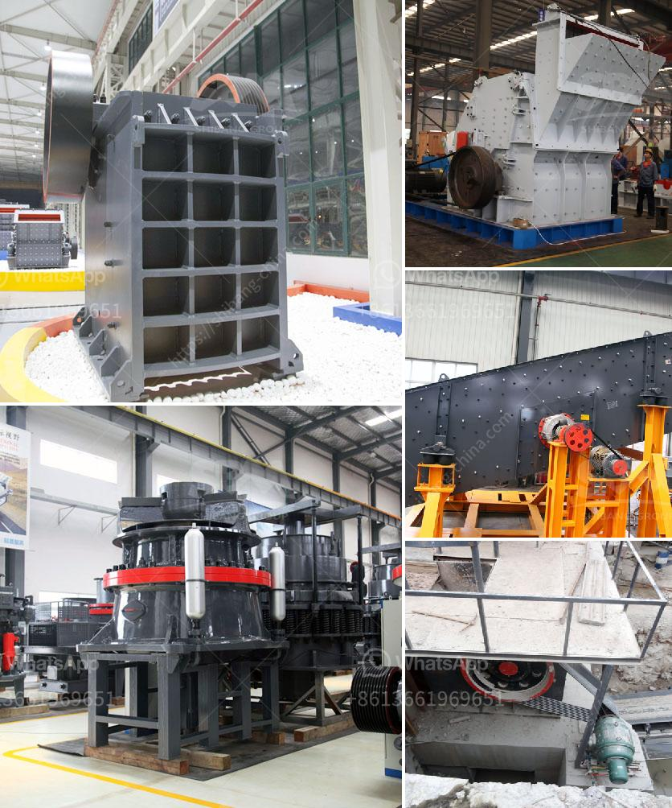

<h3>type of crushers</h3>
Crushers are heavy-duty machines designed to break large rocks into smaller, more manageable pieces. They are commonly used in the mining, construction, and recycling industries. With so many different types of crushers available, finding the right one for your project can be a difficult and time-consuming process. In this article, we will explore some of the most common types of crushers and their respective applications.

Jaw crushers are among the most popular types of crushers due to their ability to crush various materials with high compressive strength. They consist of two jaws, one fixed and one moving, which periodically reciprocate to exert pressure on the material. Jaw crushers are used to reduce the size of medium-hard to very hard materials, such as ores, rocks, and minerals.

Cone crushers are used for crushing medium-hard to hard materials, such as limestone, gravel, ore, and basalt. They work by squeezing the material between an eccentrically rotating mantle and a concave. Cone crushers are often used as secondary crushers, as they provide a finer and more cubical product compared to jaw crushers. They are also efficient for crushing materials with a high degree of hardness.

Impact crushers utilize impact rather than compression to crush materials. They are suitable for both primary and secondary crushing applications. Impact crushers are particularly effective in producing aggregates for the construction industry. They can be used to crush a variety of materials, including concrete, asphalt, and bricks. Impact crushers are known for their high reduction ratios and excellent cubicity.

Gyratory crushers are similar to jaw crushers but have a larger mantle and a concave. They are used mainly in primary crushing applications and have a high capacity compared to jaw crushers. Gyratory crushers are often used in mines and quarries as they can handle large-sized rocks with ease. They are also known for their reliability and low operating costs.

Roll crushers are designed to crush friable materials, such as coal, limestone, clay, and shale. They consist of two rolls that rotate in opposite directions. The material is fed between the rolls and undergoes compression and shear forces, resulting in its fragmentation. Roll crushers are used in various industries, including mining, construction, and chemical manufacturing.

Hammer crushers, also known as hammer mills, are used to crush materials by the repeated blows of hammers mounted on a rotating rotor. They are commonly used in cement plants, mining, and coal-fired power plants. Hammer crushers are efficient in crushing brittle materials with a low moisture content. They can produce a wide range of particle sizes, making them suitable for various applications.

In conclusion, crushers play a crucial role in various industries by reducing the size of large rocks and other materials. Jaw crushers, cone crushers, impact crushers, gyratory crushers, roll crushers, and hammer crushers all have their unique advantages and uses. The selection of the appropriate crusher depends on the specific requirements of the project at hand. Consulting with industry experts and conducting thorough research will help in making an informed decision.
<h3>Contact us</h3><ul><li><strong>Whatsapp:&nbsp;<a href="https://wa.me/8613661969651">+8613661969651</a></strong></li><li><a href="https://swt.shibang-china.com/?git&amp;zhl&amp;type of crushers"><strong>Online Service(chat now)</strong></a></li></ul><h3>Related</h3><ul><li><a href='crusher machine from south korea.md'>crusher machine from south korea</a></li><li><a href='hp cone crusher device.md'>hp cone crusher device</a></li><li><a href='iron ore vibrator screen.md'>iron ore vibrator screen</a></li><li><a href='calcium carbonate manufacturing plant.md'>calcium carbonate manufacturing plant</a></li><li><a href='demand and supply of stone ballast in kenya.md'>demand and supply of stone ballast in kenya</a></li></ul>