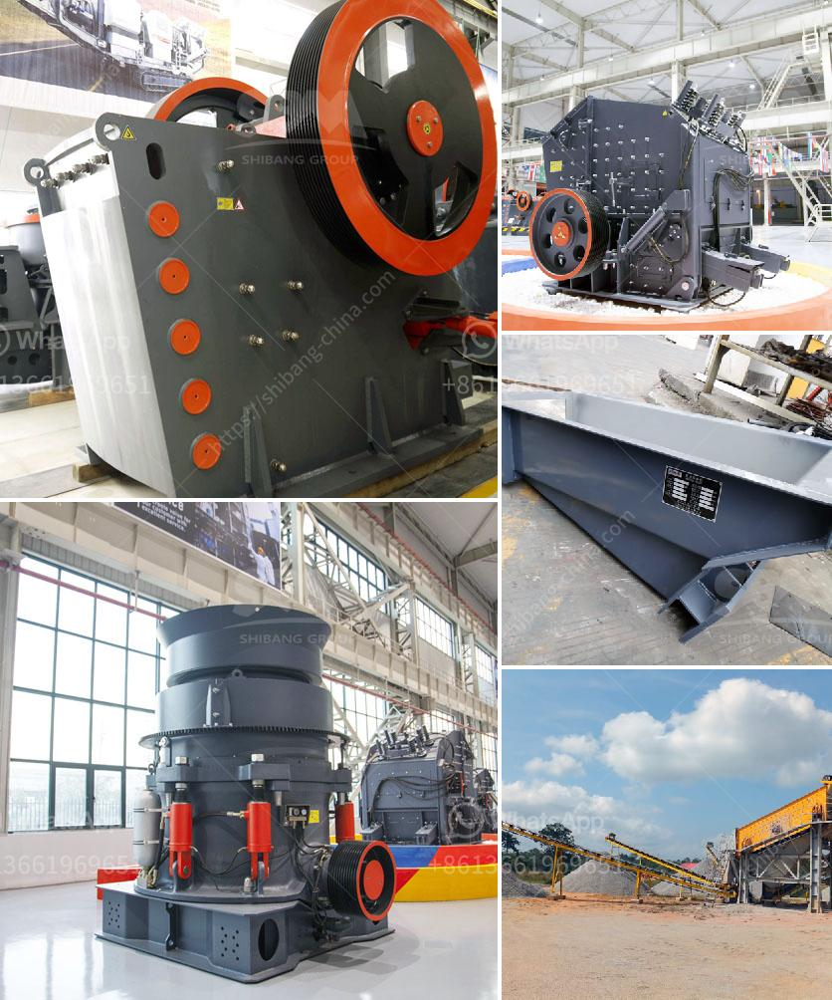

<h3>type of quarry crusher equipment</h3>
Quarrying is a common industry in many countries all over the world, particularly in mining and construction sectors. Quarrying involves extracting rocks and minerals from the earth's surface. These raw materials are then used for various purposes, such as building materials, road construction, and industrial applications.

To extract these valuable resources efficiently, quarry crusher equipment plays a crucial role. Quarry crushers are the machines used to break large rocks into smaller pieces suitable for processing. These machines have an inherent risk factor, as they frequently operate in harsh environments and handle heavy loads. Therefore, it is crucial to choose the right type of quarry crusher equipment to ensure the smooth and efficient operation of the quarry.

There are several types of quarry crusher equipment available in the market today, each with its unique features and advantages. Let's explore some of the most commonly used crusher equipment in quarries:

1. Jaw Crushers: Jaw crushers are the most common type of crusher used in quarry operations. They are designed to crush large rocks into smaller pieces, typically between 6 to 8 inches in size. Jaw crushers consist of two jaws, one fixed and the other moving. The moving jaw exerts force on the rock by compressing it against the stationary jaw, resulting in breaking the material into smaller fragments.

2. Impact Crushers: Impact crushers are commonly used for secondary crushing in quarry operations. These crushers work by using a high-speed impact force to break rocks. They operate at a higher speed than jaw crushers, resulting in a higher reduction ratio. Impact crushers are particularly suitable for processing soft to medium-hard materials.

3. Cone Crushers: Cone crushers are used for tertiary crushing in quarry operations. They are similar to gyratory crushers in terms of operation and function but have a smaller crushing chamber. Cone crushers are ideal for producing high-quality end products and can handle a wide range of materials.

4. Vertical Shaft Impactors (VSI): VSI crushers are becoming increasingly popular in quarrying operations due to their ability to produce precise and cubical end products. VSI crushers use a high-speed rotor and anvils for impact crushing. They are mainly used for shaping and fine crushing applications.

5. Screens: Screens are an essential part of quarry crushing equipment. They are used to separate different sizes of crushed materials and ensure the desired product specification. Screens can be horizontal, inclined, or multi-deck and are available in various sizes and configurations.

Choosing the right type of quarry crusher equipment depends on several factors, including the type of material to be crushed, the desired end product size, and the capacity requirements of the quarry operation. It is crucial to consult with industry experts and manufacturers to determine the most suitable equipment for specific quarrying needs.

In conclusion, quarry crusher equipment is essential for efficient and productive quarrying operations. Jaw crushers, impact crushers, cone crushers, VSI crushers, and screens are some of the commonly used quarry crusher equipment. Each type of equipment has its unique features and advantages, and careful consideration should be given to choose the right type of equipment for specific quarrying needs.
<h3>Contact us</h3><ul><li><strong>Whatsapp:&nbsp;<a href="https://wa.me/8613661969651">+8613661969651</a></strong></li><li><a href="https://swt.shibang-china.com/?git&amp;zhl&amp;type of quarry crusher equipment"><strong>Online Service(chat now)</strong></a></li></ul><h3>Related</h3><ul><li><a href='gold ore processing equipment in south africa.md'>gold ore processing equipment in south africa</a></li><li><a href='flowchart diagram for cement plant.md'>flowchart diagram for cement plant</a></li><li><a href='basalt rebar production line.md'>basalt rebar production line</a></li><li><a href='vertical shaft impact crusher south africa.md'>vertical shaft impact crusher south africa</a></li><li><a href='portable gold wash plant for sale.md'>portable gold wash plant for sale</a></li></ul>