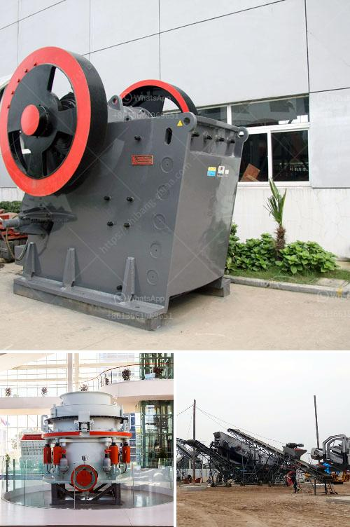

<h3>type of stone crushers</h3>
Stone crushers are widely used in mining, metallurgy, building materials, highways, railways, water conservancy and chemical industries. And CHAENG is a famous foundry factory in Henan Province, which has rich experience in providing custom-made mechanical parts for the mining industry, building materials industry, metallurgical industry, construction industry and other fields, including dust collectors, crushers and spare parts. According to the characteristics of the raw materials, different stone crushers are selected to break down the rocks into desired sizes.

Firstly, there are primary and secondary crushers. Both of them work in the stone crushing plant (such as the limestone crushing plant, granite crushing plant and so on) and they are indispensable in the stone production line. Therefore, the different types of stone crushers are the jaw crusher, the impact crusher, the hammer crusher, etc. These stone crushers are used for stone/mineral breaking and sand making for further mineral separation.

Secondly, the different types of stone crushers could be classified into three main groups: jaw crusher, cone crusher, and impact crusher. Jaw crusher is mainly used for coarse crushing, its discharge port is relatively large, occupied a large area, and therefore, the production line is mainly used by gravel plants with smaller production capacity. Cone crusher is mainly used for medium and fine crushing, its main advantage is that it has a large production capacity, and therefore, the large-scale mine and the processing plant may apply it in mining, metallurgy, building materials, and highways industries. Finally, the impact crusher is mostly used to process the artificially processed materials and rocks to produce high-quality sand and stone materials, so the demand for this type of equipment is also increasing.

Thirdly, mobile crushing plant has semi-open discharge system, so it is suitable for crushing construction waste containing a large amount of steel bar. When the impact crusher is working, the plate hammers that distributed on the rotor according to different rules will hit the material on the reaction liner for crushing. Different uses. Jaw crusher is generally used as a coarse crushing device, and impact crusher is mostly used for the medium and fine crushing of materials. The former can process materials with a hardness and size greater than the latter. Different capacity.

Although jaw crushers and impact crushers have various models and a wide range of production capacity, in general, the former has a larger production capacity than the latter; Different output fineness. It can be seen from the use of jaw crusher is a first-level crushing equipment for materials, and the impact crusher is a second crusher or a third crusher. It is processed so that the particles of the finished product are smaller than the broken jaw, which can also be seen from the difference in the position of the two in the production line; Different crushing cavity shapes. The crushing chamber of the jaw crusher is composed of two jaw plates, a movable jaw and a static jaw, which simulate the movement of the two jaws of the animal to complete the crushing operation of the material. It is widely used in the crushing of various ores and bulk materials in mining, smelting, building materials, highways, railways, water conservancy and chemical industries.

In conclusion, the stone crushers of various types have their own advantages and shortcomings, which depending on the characteristics of the materials at different stages of production. As the professional stone crusher manufacturer, Chaeng will provide the ideal selection and configuration for you according to your production requirements.
<h3>Contact us</h3><ul><li><strong>Whatsapp:&nbsp;<a href="https://wa.me/8613661969651">+8613661969651</a></strong></li><li><a href="https://swt.shibang-china.com/?git&amp;zhl&amp;type of stone crushers"><strong>Online Service(chat now)</strong></a></li></ul><h3>Related</h3><ul><li><a href='raymond mill grinding.md'>raymond mill grinding</a></li><li><a href='granite and basalt crushing line ton per day.md'>granite and basalt crushing line ton per day</a></li><li><a href='ball milling machines suppliers in egypt.md'>ball milling machines suppliers in egypt</a></li><li><a href='vibrating screen size 1mm.md'>vibrating screen size 1mm</a></li><li><a href='stone crushers for sale uk finance.md'>stone crushers for sale uk finance</a></li></ul>