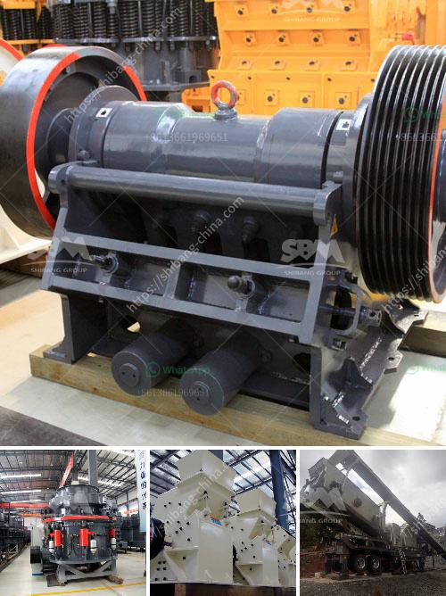

<h3>uk made stone crushing machine</h3>
The United Kingdom is renowned for producing world-class innovative machinery for various industrial sectors. Among these, stone crushing machines have gained significant attention due to their exceptional craftsmanship and durability. With advanced technology, UK manufacturers have made it possible to produce highly efficient and reliable stone crushing machines that assist in various construction and mining projects.

One of the key reasons why UK-made stone crushing machines are highly sought after is their exceptional quality and durability. These machines are built to withstand heavy workloads and harsh environments, ensuring prolonged functionality without compromise. UK manufacturers take pride in using high-grade materials, precision engineering, and strict quality control measures to ensure their machines can withstand the toughest conditions.

Advancements in technology have played a pivotal role in enhancing the efficiency and productivity of stone crushing machines. UK manufacturers continuously invest in research and development to incorporate the latest technological innovations into their machines. This enables the machines to have better control systems, improved automation, and enhanced precision, resulting in higher output and better performance for the operators.

UK-made stone crushing machines are designed to cater to a wide range of applications in the construction and mining industries. These machines can crush various types of stones into different sizes, making them suitable for a multitude of projects. Whether it's road construction, building foundations, or mining operations, UK-made stone crushing machines provide versatile solutions to meet diverse needs.

In recent years, there has been an increased focus on sustainability and reducing environmental impact. UK manufacturers have taken this into account by incorporating eco-friendly features into their stone crushing machines. These features include advanced dust suppression systems, reduced noise levels, and energy-efficient mechanisms. By reducing emissions and minimizing environmental disruption, UK-made stone crushing machines align with the sustainable practices of today's world.

UK manufacturers prioritize customer satisfaction by offering reliable machinery and comprehensive aftersales support. This includes providing warranties, spare parts availability, and technical assistance. Users can be confident that their stone crushing machines will be operational for an extended period, and in case of any issues, UK manufacturers ensure prompt resolution to minimize downtime.

The United Kingdom has established itself as a leading hub for the production of stone crushing machines. With a focus on excellent craftsmanship, advanced technology, and sustainability, UK manufacturers offer reliable and versatile machinery that contributes to various construction and mining projects worldwide. These machines are built to withstand heavy workloads and harsh conditions, thus providing continued productivity and efficiency to operators. Investing in a UK-made stone crushing machine ensures receiving a durable, high-quality, and environmentally conscious solution that is backed by excellent aftersales support.
<h3>Contact us</h3><ul><li><strong>Whatsapp:&nbsp;<a href="https://wa.me/8613661969651">+8613661969651</a></strong></li><li><a href="https://swt.shibang-china.com/?git&amp;zhl&amp;uk made stone crushing machine"><strong>Online Service(chat now)</strong></a></li></ul><h3>Related</h3><ul><li><a href='cone crusher from china.md'>cone crusher from china</a></li><li><a href='river stone crusher for sale.md'>river stone crusher for sale</a></li><li><a href='jaw crusher for sale in spain.md'>jaw crusher for sale in spain</a></li><li><a href='used quarry equipment for sale in calgary canada.md'>used quarry equipment for sale in calgary canada</a></li><li><a href='mining ball mill.md'>mining ball mill</a></li></ul>