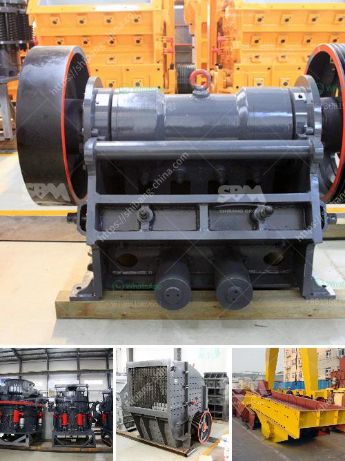

<h3>ultra fine grinding mills</h3>
Ultra-fine grinding mills are widely used in all industries requiring fine and superfine powder production. Such mills are characterized by high efficiency, low energy consumption per unit, strong adaptability, easy adjustment of particle size distribution (PSD), continuous operation, simple maintenance, and so on. They can be used for grinding various materials, such as non-metallic minerals (calcite, marble, limestone, barite, kaolin, etc.), metal oxides (aluminum oxide, iron oxide, etc.), chemicals (paint, coating, pesticide, etc.), and food additives.

The technology behind ultra-fine grinding mills stems from the need for economic and efficient grinding processes. As the demand for finer and finer particles increases, traditional milling methods become less effective and energy-intensive. Ultra-fine grinding mills solve this problem by utilizing a series of grinding media (beads or balls) in various sizes to reduce the particle size distribution and achieve the desired fineness. The smaller the grinding media, the finer the product, and the larger the grinding media, the coarser the product.

In addition to their high efficiency and low energy consumption, ultra-fine grinding mills offer a high degree of control over the final product. This is achieved through adjustable speed, residence time, and grinding media size. The ability to adjust these parameters allows for precise control of the PSD, ensuring that the final product meets the desired specifications. Furthermore, ultra-fine grinding mills can be integrated with classifiers to separate the fine particles from the coarse ones, further enhancing product quality.

Overall, ultra-fine grinding mills are essential equipment for fine and superfine powder production. They offer numerous advantages, including high efficiency, low energy consumption, and precise control over particle size distribution. With the increasing demand for finer particles in various industries, the use of ultra-fine grinding mills will continue to expand, contributing to improved product quality and enhanced process efficiency.
<h3>Contact us</h3><ul><li><strong>Whatsapp:&nbsp;<a href="https://wa.me/8613661969651">+8613661969651</a></strong></li><li><a href="https://swt.shibang-china.com/?git&amp;zhl&amp;ultra fine grinding mills"><strong>Online Service(chat now)</strong></a></li></ul><h3>Related</h3><ul><li><a href='raymond mill grinding.md'>raymond mill grinding</a></li><li><a href='i want to buy a quarry machine nigeria.md'>i want to buy a quarry machine nigeria</a></li><li><a href='portable sand washing machine.md'>portable sand washing machine</a></li><li><a href='ball mill grinding relation with quality pdf.md'>ball mill grinding relation with quality pdf</a></li><li><a href='vertical mill mining.md'>vertical mill mining</a></li></ul>