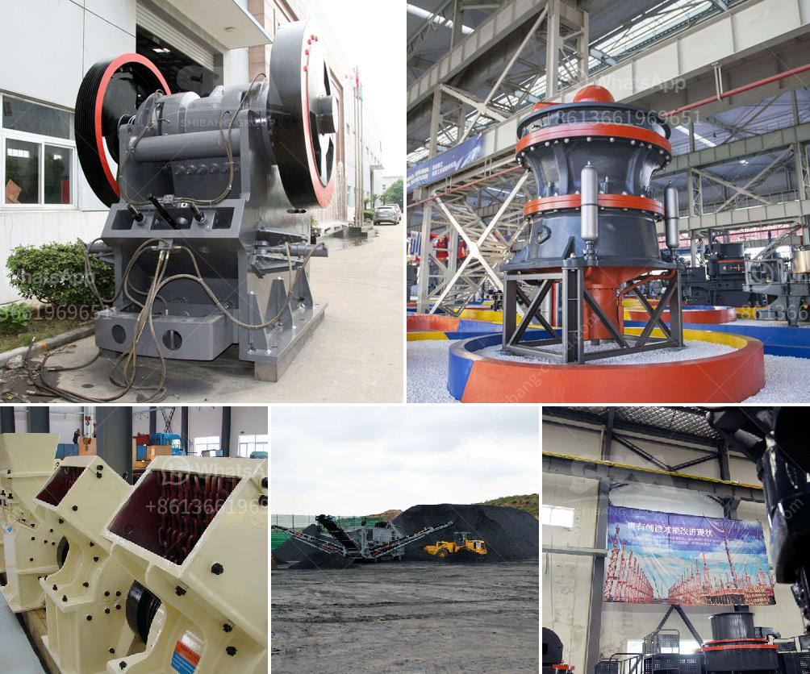

<h3>used ball mill south africa</h3>
Used Ball Mill South Africa is the key equipment for grinding after the crushing process, which is widely used in the manufacture industries, such as cement, silicate, new building material, refractory material, fertilizer, ferrous metal, nonferrous metal and glass ceramics and can be used for the dry and wet grinding for all kinds of ores and other grind-able materials.

Used Ball Mill South Africa realizes both economic and environmental benefits. It evolved from the traditional ball mill to fully automated, high-yield production line. Through continuous technological innovation, it has achieved the improvement of mechanical efficiency, electromagnetic speed and particle size distribution stability.

Used Ball Mill South Africa adopts the integrated frame structure, which eliminates the complex layout of the foundation structure, reduces the installation time and cost of infrastructure, and reduces the impact on basic construction. The grinding cavity is produced by the high temperature sintering of high thermal conductivity alumina ceramics and can withstand a temperature of more than 2000 °C.

In the Grinding Equipment South Africa, the selection of structure is based on the merits of the original equipment, such as low maintenance costs, reliable operation, safety in use, and trouble-free operation. Therefore, the structure directly affects the grinding performance and service life of the equipment.

Used Ball Mill South Africa's liners are made of cast steel or rubber, and they are replaced when they are worn out. The lining plate is spiral, which effectively increases the mixing capacity of the grinding medium and effectively increases the grinding area and the grinding range, thereby improving the grinding efficiency.

Used Ball Mill South Africa integrates crushing, drying, grinding and grading and conveying. The system is simple, compact and reasonable. The floor space is about 50% of the ball milling system, and it can be arranged in the open air, so it can greatly reduce the investment cost.

The product particle size can be adjusted within a wide range, which is more conducive to increasing the application range of the product. The finished product has uniform particle size, suitable for ultra-fine powder processing, and the particle shape is excellent, which is more popular among users.

In conclusion, Used Ball Mill South Africa has strong adaptability, has been widely used in the grinding of minerals, cement, refractory materials and other industrial sectors, saving production costs for customers, improving work efficiency and bringing more benefits to users. With the continuous innovation and improvement of technology, it will continue to develop and occupy a larger market share in the future.
<h3>Contact us</h3><ul><li><strong>Whatsapp:&nbsp;<a href="https://wa.me/8613661969651">+8613661969651</a></strong></li><li><a href="https://swt.shibang-china.com/?git&amp;zhl&amp;used ball mill south africa"><strong>Online Service(chat now)</strong></a></li></ul><h3>Related</h3><ul><li><a href='gold mining production line or gold mining plant.md'>gold mining production line or gold mining plant</a></li><li><a href='quartz crusher prices.md'>quartz crusher prices</a></li><li><a href='stone crusher south africa.md'>stone crusher south africa</a></li><li><a href='vertical ball grinding mills.md'>vertical ball grinding mills</a></li><li><a href='coal mining machines in india.md'>coal mining machines in india</a></li></ul>