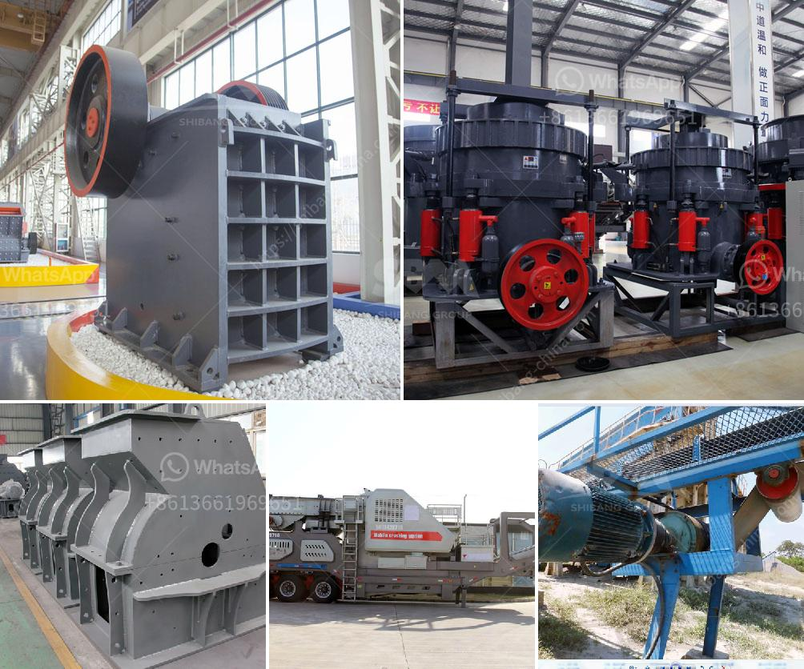

<h3>used ball milling machine for sale canada</h3>
Are you in the market for a ball milling machine? If so, you might want to consider purchasing a used one. Canada offers a plethora of options when it comes to used industrial machinery, including ball milling machines. In this article, we will explore the benefits of purchasing a used ball milling machine in Canada.

Firstly, let's discuss what a ball milling machine is. A ball milling machine is a piece of machinery used for grinding and mixing materials, often used in the ceramic industry. The machine can be filled with different types of balls, depending on the material being processed. Common materials used include ceramic balls, steel balls, and stainless steel balls. The grinding process occurs when the balls collide with each other and the material being processed, resulting in a finely ground product.

One of the main advantages of purchasing a used ball milling machine in Canada is cost savings. Used machinery is typically significantly cheaper than buying a brand-new machine. This is especially true for ball milling machines, as they can be quite expensive when purchased new. By opting for a used machine, you can get a high-quality piece of equipment at a fraction of the cost.

Additionally, used ball milling machines often come with a warranty or guarantee, providing further reassurance for buyers. This means that if any issues arise after the purchase, you can seek assistance from the seller or manufacturer to rectify the problem. This is a valuable benefit, as you can rest easy knowing that your investment is protected.

Another advantage of buying used machinery is availability. Canada has a thriving industrial sector, resulting in a great variety of used machinery being available for purchase. Whether you are looking for a specific make or model or are open to different options, you are likely to find a suitable used ball milling machine in Canada.

When buying used machinery, it is essential to thoroughly inspect the machine before making a purchase. This includes examining the machine for signs of wear and tear, checking the functionality of all parts and components, and asking for any maintenance records or service history. Doing so will help ensure that you are purchasing a machine in good working condition that will meet your production needs.

In conclusion, purchasing a used ball milling machine in Canada offers several benefits such as cost savings, warranties or guarantees, and availability. By opting for a used machine, you can save money without compromising on quality. However, it is crucial to conduct a thorough inspection of the machine before finalizing the purchase. So if you are in the market for a ball milling machine, consider exploring the vast array of used options available in Canada.
<h3>Contact us</h3><ul><li><strong>Whatsapp:&nbsp;<a href="https://wa.me/8613661969651">+8613661969651</a></strong></li><li><a href="https://swt.shibang-china.com/?git&amp;zhl&amp;used ball milling machine for sale canada"><strong>Online Service(chat now)</strong></a></li></ul><h3>Related</h3><ul><li><a href='screening coal crushing plant.md'>screening coal crushing plant</a></li><li><a href='stone crushing plant in pakistan.md'>stone crushing plant in pakistan</a></li><li><a href='used crusher machines from china.md'>used crusher machines from china</a></li><li><a href='stone crushing machines for sale.md'>stone crushing machines for sale</a></li><li><a href='concrete crusher for rent michigan.md'>concrete crusher for rent michigan</a></li></ul>