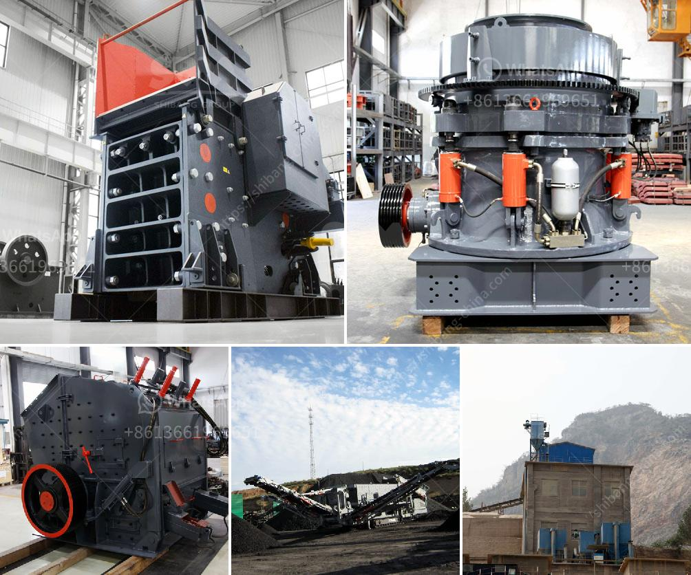

<h3>used classifiers for sale from alpine</h3>
If you are in the market for purchasing a classifier, Alpine is a trusted brand known for its high-quality products. Alpine offers a wide range of used classifiers for sale, providing customers with cost-effective options that meet their budget requirements. These used classifiers have been carefully inspected and refurbished by Alpine, ensuring their reliability and performance.

Classifiers are essential equipment widely used in various industries, including mining, construction, and chemical processing. They are designed to separate and sort different materials based on their size, shape, or density. Alpine classifiers are known for delivering accurate and efficient results, enabling businesses to optimize their production processes.

The benefit of purchasing used classifiers from Alpine is the significant cost savings compared to buying new equipment. As the demand for classifiers increases, investing in used options becomes an attractive choice for businesses looking to reduce initial expenditure. Alpine ensures that their used classifiers are thoroughly evaluated, repaired, and maintained to ensure they operate at optimal performance.

One advantage of buying used classifiers from Alpine is the opportunity to acquire models that may no longer be in production. This allows customers to access specialized classifiers that might not be available as new units. Additionally, purchasing used equipment from a reputable brand like Alpine ensures that you are still receiving a high-quality product that meets industry standards.

All used classifiers from Alpine undergo a rigorous inspection process conducted by their team of experts. Any necessary repairs or replacements are made to ensure that the equipment is restored to its optimum functionality. Alpine's commitment to quality control ensures that their used classifiers are reliable and can be seamlessly integrated into existing production lines.

When purchasing used classifiers, it's important to consider the specific requirements of your industry and production needs. Alpine offers various models with different features, sizes, and capabilities. Having a clear understanding of your application will help you choose the most suitable classifier that aligns with your business goals.

Another advantage of purchasing used classifiers from Alpine is their excellent customer support. Alpine provides technical assistance and guidance to customers, ensuring that their purchased equipment is correctly installed and maintained. This level of support helps businesses to optimize their classifier's performance and maximize their return on investment.

In conclusion, if you are in the market for a classifier, Alpine offers a range of used options for sale that are reliable, affordable, and backed by the reputation of a respected brand. These classifiers undergo a meticulous refurbishment process to ensure they meet the highest standards of quality and performance. By choosing a used classifier from Alpine, you can benefit from cost savings and access to specialized models that may no longer be in production. With Alpine's commitment to customer support, you can be confident in your purchase and expect reliable technical assistance throughout the classifier's lifespan.
<h3>Contact us</h3><ul><li><strong>Whatsapp:&nbsp;<a href="https://wa.me/8613661969651">+8613661969651</a></strong></li><li><a href="https://swt.shibang-china.com/?git&amp;zhl&amp;used classifiers for sale from alpine"><strong>Online Service(chat now)</strong></a></li></ul><h3>Related</h3><ul><li><a href='ball mill maintenance seminar.md'>ball mill maintenance seminar</a></li><li><a href='barite mill specifications.md'>barite mill specifications</a></li><li><a href='complete stone crushing plant.md'>complete stone crushing plant</a></li><li><a href='large capacity jaw crusher stone crusher quarry machine.md'>large capacity jaw crusher stone crusher quarry machine</a></li><li><a href='ball mills for clay.md'>ball mills for clay</a></li></ul>