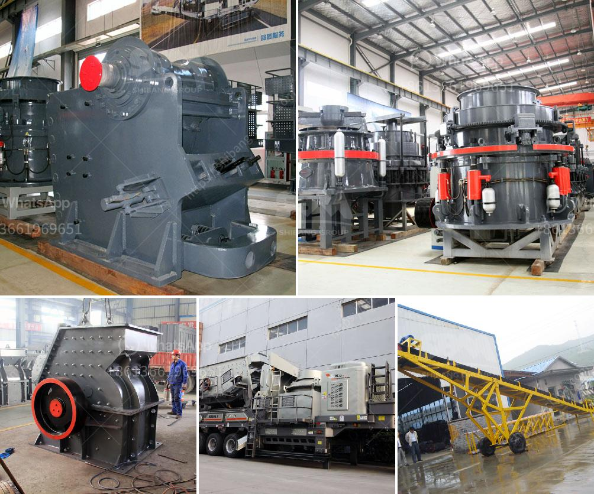

<h3>used concrete crusher price in uk</h3>
When it comes to construction and infrastructure projects, concrete is an essential material that plays a crucial role. However, after demolition or renovation projects, there is often a significant amount of concrete waste that needs to be disposed of. This is where a used concrete crusher comes into play. These machines are designed to crush concrete into smaller, more manageable pieces, making it easier to transport and recycle.

One of the main factors to consider when purchasing a used concrete crusher is the price. There are many different models and brands available on the market, each with its own price range. The price of a used concrete crusher in the UK can vary depending on the model, condition, and age of the machine.

On average, you can expect to pay between £10,000 and £30,000 for a used concrete crusher in good condition. Older models or machines that require some repairs may have a lower price tag, while newer models or those with additional features may be more expensive. It is essential to consider your specific needs and budget when determining the price range you are comfortable with.

There are several factors that can influence the price of a used concrete crusher. The first is the brand and reputation of the machine. Well-known brands with a history of producing high-quality and reliable equipment often come with a higher price tag. However, they are also more likely to have a longer lifespan and require fewer repairs, making them a worthwhile investment.

Another factor to consider is the condition of the used concrete crusher. Machines in good condition that have been properly maintained will generally have a higher price than those that require significant repairs or have parts that need replacing. It is essential to thoroughly inspect the machine and ask for a maintenance log or service history to assess its condition accurately.

Additionally, the age of the used concrete crusher can affect its price. Newer models with the latest technology and features may command a higher price than older models. However, older models may still be highly functional and suitable for your specific needs. It is important to evaluate the machine's performance and capabilities rather than just its age.

One way to ensure you are getting a fair price for a used concrete crusher in the UK is to compare prices from different sellers. Online marketplaces and auctions can provide you with a range of options and allow you to compare prices easily. It is also recommended to reach out to several sellers and inquire about the condition, age, and specific features of the machines they have available. This will enable you to make an informed decision.

In conclusion, purchasing a used concrete crusher in the UK can be a cost-effective solution for construction projects and waste management. The price of a used concrete crusher can vary depending on factors such as brand, condition, and age. It is important to thoroughly research and compare prices to ensure you are obtaining a quality machine at a fair price. By considering your specific needs and budget, you can find a used concrete crusher that meets your requirements while staying within your price range.
<h3>Contact us</h3><ul><li><strong>Whatsapp:&nbsp;<a href="https://wa.me/8613661969651">+8613661969651</a></strong></li><li><a href="https://swt.shibang-china.com/?git&amp;zhl&amp;used concrete crusher price in uk"><strong>Online Service(chat now)</strong></a></li></ul><h3>Related</h3><ul><li><a href='jaw crusher manufacturer in china.md'>jaw crusher manufacturer in china</a></li><li><a href='contribution of quarrying in nigeria economy.md'>contribution of quarrying in nigeria economy</a></li><li><a href='cost of quarry crusher machines.md'>cost of quarry crusher machines</a></li><li><a href='enquiry jaw crusher.md'>enquiry jaw crusher</a></li><li><a href='hammer crusher dimension.md'>hammer crusher dimension</a></li></ul>