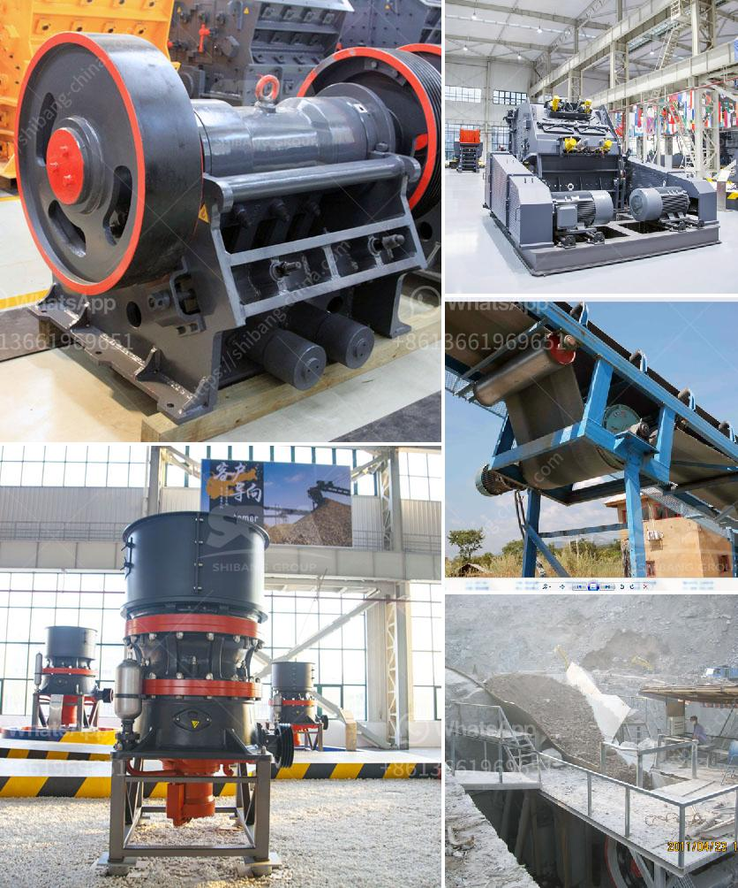

<h3>used construction machinery rates in pakistan</h3>
Pakistan is a developing country where infrastructure development is in full swing. The construction industry is a major contributor to the country's economic growth. However, the high cost of brand new construction machinery often poses a challenge for many contractors and small construction firms. In such cases, opting for used construction machinery becomes a viable and cost-effective solution. This article will delve into the rates of used construction machinery in Pakistan.

The rates of used construction machinery in Pakistan vary depending on several factors. One of the significant factors is the age and condition of the machinery. Construction machinery that is relatively new and in excellent working condition will cost more than older and worn-out machines. A well-maintained used construction machinery unit with low operating hours can be an attractive purchase for those on a budget.

Moreover, the brand and reputation of the manufacturer play a significant role in determining the rates. Machinery manufactured by renowned brands often carries a higher price tag due to their reliability, performance, and durability. These brands have established their credibility in the market, and their machines hold their value well.

Aside from the age and brand of the machinery, the type of construction equipment also impacts its rates. There are various types of machinery used in construction projects, such as excavators, cranes, loaders, bulldozers, and concrete mixers, among others. Each type of equipment has its own market demand and price range. For instance, due to their versatility and widespread use, excavators tend to be more expensive compared to other types of equipment.

Additionally, the availability and demand for specific machinery in the used market dictate its rates. If there is a high demand for a particular type of construction machinery and its availability is limited, the prices may be higher. On the other hand, if there is an oversupply of a specific type of machinery, the rates might decrease. The market dynamics heavily influence the prices of used construction machinery.

The rates of used construction machinery can also vary depending on the location. Urban areas, such as Lahore, Karachi, and Islamabad, usually have higher rates due to the increased demand and competition in these regions. However, rates may be comparatively lower in rural areas or smaller towns where the demand is relatively lower.

It is essential to consider the condition of the used machinery before making a purchase. Buyers should thoroughly inspect the equipment and perform a test run to ensure that it is fully functional and meets their requirements. Obtaining the machinery's maintenance history and service records can also provide insight into its reliability and performance.

In conclusion, used construction machinery can be an excellent alternative for contractors and small construction firms in Pakistan who are working on a tight budget. The rates of used machinery in Pakistan depend on various factors such as machinery age, brand reputation, type of equipment, market demand, and availability. Buyers should thoroughly inspect the machinery's condition before making a purchase to ensure its reliability and suitability for their projects. With careful research and consideration, contractors can find cost-effective options that meet their construction needs.
<h3>Contact us</h3><ul><li><strong>Whatsapp:&nbsp;<a href="https://wa.me/8613661969651">+8613661969651</a></strong></li><li><a href="https://swt.shibang-china.com/?git&amp;zhl&amp;used construction machinery rates in pakistan"><strong>Online Service(chat now)</strong></a></li></ul><h3>Related</h3><ul><li><a href='models and prices of vibrating screens.md'>models and prices of vibrating screens</a></li><li><a href='jaw crusher indonesia agent.md'>jaw crusher indonesia agent</a></li><li><a href='sand crusher cost.md'>sand crusher cost</a></li><li><a href='crusher hydroponic cone crusher.md'>crusher hydroponic cone crusher</a></li><li><a href='stone crusher in egypt.md'>stone crusher in egypt</a></li></ul>