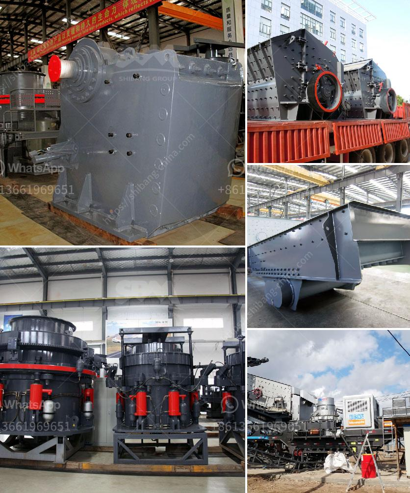

<h3>used crusher machines from china</h3>
China, known for being the largest supplier of various industrial equipment, has contributed significantly to the growth of the mining industry. As with any sector, the extraction of minerals requires the use of heavy machinery to ensure a smooth and efficient operation. Therefore, the demand for crusher machines, a vital equipment in the mining industry, has been on the rise.

When it comes to purchasing crusher machines, China offers a cost-effective solution, especially with the availability of used machines. These pre-owned crushers offer immense benefits to mining operations, allowing them to acquire high-quality equipment at a fraction of the cost of new machines.

One key advantage of buying used crusher machines from China is the extensive options available. China's mining industry is vast, and consequently, there are numerous used crusher machines available in the market. This wide selection allows mining operators to choose the specific equipment that best suits their requirements and budgets.

Furthermore, used crusher machines from China come with the added advantage of reduced lead times. Purchasing new equipment often entails long waiting periods due to manufacturing and shipping processes. However, with used machines, the lead time is significantly reduced, ensuring a quicker setup for mining operations.

China's reputation for producing durable and reliable machinery also extends to their used crusher machines. By choosing reputable suppliers and conducting thorough inspections, mining operators can acquire pre-owned crushers that are in excellent working condition. This saves unnecessary costs on repairs and maintenance, while ensuring the longevity of the equipment.

Despite the numerous advantages, it is essential for mining operators to exercise caution when purchasing used crusher machines from China. Conducting a thorough inspection of the equipment, including testing its functionality, is crucial to avoid any potential setbacks once the machine is in operation.

In conclusion, used crusher machines from China offer a viable option for mining operations aiming to cut costs without compromising on quality. The extensive selection, reduced lead times, and reliable machinery make these pre-owned crushers an attractive choice. However, proper inspection and verification processes are vital to ensure the machines' performance and durability. By considering these factors, mining operators can optimize their operations while reaping the benefits of China's used crusher machines.
<h3>Contact us</h3><ul><li><strong>Whatsapp:&nbsp;<a href="https://wa.me/8613661969651">+8613661969651</a></strong></li><li><a href="https://swt.shibang-china.com/?git&amp;zhl&amp;used crusher machines from china"><strong>Online Service(chat now)</strong></a></li></ul><h3>Related</h3><ul><li><a href='vibrating screen size 1mm.md'>vibrating screen size 1mm</a></li><li><a href='impact coal crusher.md'>impact coal crusher</a></li><li><a href='formula for belt conveyor tonne per hour.md'>formula for belt conveyor tonne per hour</a></li><li><a href='i want to buy a quarry machine nigeria.md'>i want to buy a quarry machine nigeria</a></li><li><a href='hammer crusher china.md'>hammer crusher china</a></li></ul>