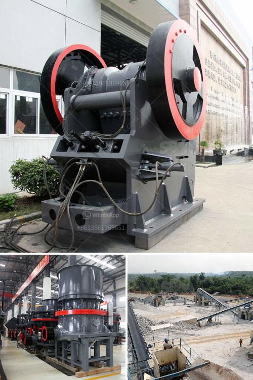

<h3>used crusher mobile for sale in uae</h3>
When rocks and materials need to be crushed, aspirational construction and recycling companies seek crusher mobile for sale in UAE. They are an important part of many industrial and construction projects, especially those that require the breaking down of large rocks into smaller, more manageable sizes. Mobile crushers are capable of processing a wide range of materials, from rocks and minerals to concrete, asphalt, and demolition waste.

There are several reasons why purchasing a used crusher mobile in UAE is a beneficial option for contracting and recycling projects. Firstly, used crushers are more cost-effective compared to brand new ones. While new crushers come with a hefty price tag, used crushers are significantly more affordable without sacrificing quality. This is especially appealing to companies with tighter budgets or those who prefer to allocate resources towards other aspects of their projects.

Moreover, used crusher mobiles offer a diverse selection of models and types that are suitable for different applications. Whether it's a jaw crusher for primary crushing, impact crusher for secondary crushing, or a cone crusher for tertiary crushing, there is a mobile crusher model to suit various needs. Each model is specifically engineered to maximize productivity and efficiency, resulting in optimal performance on the job site.

Another advantage of opting for used crusher mobiles is the immediate availability. Unlike waiting for new equipment to be manufactured and delivered, used crushers are readily available, allowing companies to get started on their projects without delay. Time is of the essence in construction and recycling projects, and having a crusher mobile readily available ensures that deadlines are met and projects are completed in a timely manner.

Additionally, used crusher mobiles also have the benefit of being thoroughly inspected and tested, ensuring that they are in good working condition before being sold. Reputable sellers and dealers ensure that the crushers are in compliance with safety and performance standards to provide peace of mind to potential buyers. With this, companies can trust in the reliability and performance of the used mobile crushers they purchase.

Finally, investing in used crusher mobiles promotes sustainability and environmental responsibility. By recycling materials and repurposing them as new construction materials, companies contribute to the circular economy and reduce the environmental impact of their projects. Used crushers help to maximize the reuse of materials, resulting in less waste heading to landfills and a more sustainable approach to construction and recycling.

Used crusher mobiles are an attractive option for contracting and recycling companies in UAE due to their affordability, availability, and versatility. By choosing used over brand new crushers, companies can save money, select from a wider range of models, and start their projects immediately. Additionally, they can trust in the quality and performance of these used mobile crushers, resulting in efficient and sustainable operations. With the numerous benefits they offer, it's no wonder that used crusher mobiles are highly sought after in the UAE market.
<h3>Contact us</h3><ul><li><strong>Whatsapp:&nbsp;<a href="https://wa.me/8613661969651">+8613661969651</a></strong></li><li><a href="https://swt.shibang-china.com/?git&amp;zhl&amp;used crusher mobile for sale in uae"><strong>Online Service(chat now)</strong></a></li></ul><h3>Related</h3><ul><li><a href='jual stone crusher mobile cap 30 tph in indonesia.md'>jual stone crusher mobile cap 30 tph in indonesia</a></li><li><a href='ethiopia with crusher for sale.md'>ethiopia with crusher for sale</a></li><li><a href='lm series vertical mill.md'>lm series vertical mill</a></li><li><a href='application procedure for ball mill.md'>application procedure for ball mill</a></li><li><a href='manufacturer of rotary screen for crushed lime stone.md'>manufacturer of rotary screen for crushed lime stone</a></li></ul>