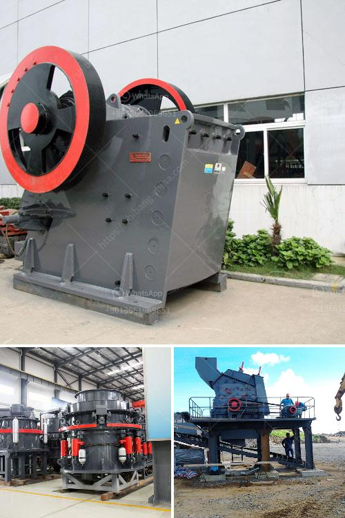

<h3>used crushers sale usa</h3>
Crushing is an essential process in diverse industries such as construction, mining, refining, and recycling. However, not all crushers are created equal, and not all crushers can handle different types of materials. Hence, it is important to do thorough research before choosing the right crusher for your operations. One option worth considering is purchasing used crushers, as they offer several advantages over new ones, especially for those on a tight budget.

When it comes to used crushers for sale in the USA, there is a wide range of options available in the market. These crushers can be classified into two main categories: jaw crushers and impact crushers. Jaw crushers are primarily used for coarse crushing, while impact crushers are commonly used for secondary or tertiary crushing.

Used crushers offer cost savings compared to their brand-new counterparts. Depending on the age, model, and condition of the crusher, the cost savings can range from 30% to 70% of the original price. This can be a significant financial advantage, especially for small and medium-sized businesses looking to optimize their operational costs.

However, cost savings are not the only advantage of buying used crushers. Another benefit is quick availability. Unlike new crushers, which may have long lead times due to manufacturing and shipping, used crushers are readily available and can be put into operation immediately. This is particularly important for businesses with time-sensitive projects or those seeking to replace a broken or outdated crusher as quickly as possible.

Furthermore, used crushers often come with a documented service history. This allows potential buyers to assess the maintenance records and identify if the crusher has been well-maintained or if any major repairs have been carried out. By having this information, buyers can make informed decisions regarding the overall condition and reliability of the machine.

Before purchasing a used crusher, it is crucial to inspect it thoroughly. This includes checking the working condition of all mechanical and electrical components, examining the wear and tear on the crushing chamber and other critical parts, and ensuring that it is compliant with safety regulations. It is highly recommended to engage the services of a qualified engineer or crusher technician to perform a comprehensive inspection and provide an assessment of the crusher's condition.

While purchasing used crushers can be a smart decision, it is important to source them from reputable and trustworthy suppliers. There are several online platforms, such as MachineryTrader and IronPlanet, specializing in the sale of used equipment, including crushers. These platforms often provide detailed descriptions, photos, and specifications of the available crushers, enabling buyers to make informed choices.

In conclusion, choosing used crushers for sale in the USA can be a cost-effective solution for businesses in various industries. They offer significant cost savings, quick availability, and documented service history. However, buyers should conduct thorough inspections and ensure they are purchasing from reputable sources. By doing so, they can acquire reliable crushers that meet their specific crushing needs while minimizing their overall operational expenses.
<h3>Contact us</h3><ul><li><strong>Whatsapp:&nbsp;<a href="https://wa.me/8613661969651">+8613661969651</a></strong></li><li><a href="https://swt.shibang-china.com/?git&amp;zhl&amp;used crushers sale usa"><strong>Online Service(chat now)</strong></a></li></ul><h3>Related</h3><ul><li><a href='granite crusher processing machines south africa.md'>granite crusher processing machines south africa</a></li><li><a href='jual stone crusher mobile cap 30 tph in indonesia.md'>jual stone crusher mobile cap 30 tph in indonesia</a></li><li><a href='mobile crusher hire durban.md'>mobile crusher hire durban</a></li><li><a href='gypsum machine price.md'>gypsum machine price</a></li><li><a href='how to process quartz ore crusher.md'>how to process quartz ore crusher</a></li></ul>