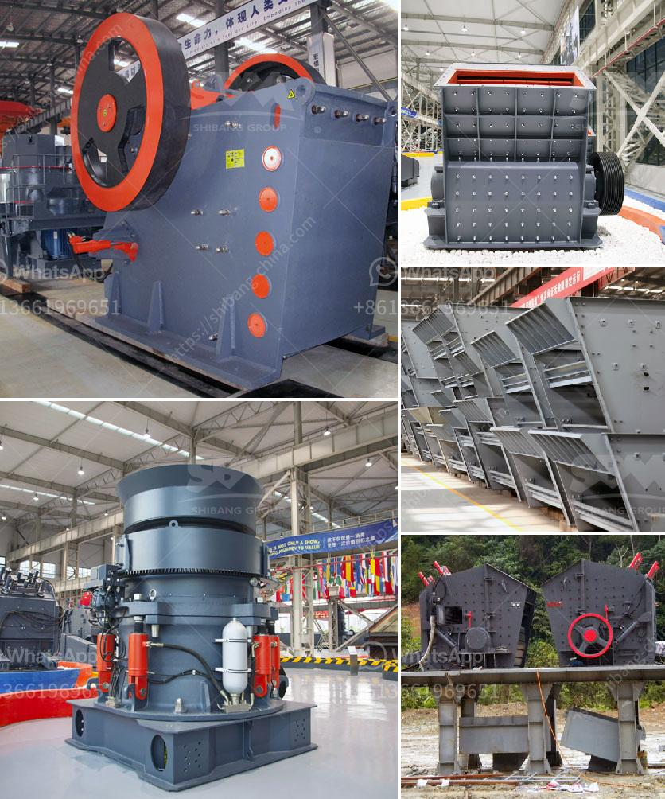

<h3>used floor grinding machines for sale</h3>
When it comes to restoring or refinishing concrete floors, investing in high-quality equipment is crucial. Floor grinding machines are the go-to tools for most flooring contractors as they provide an efficient and effective way to prepare concrete surfaces for coatings or finishes. However, purchasing brand-new equipment can be expensive, especially for small businesses or contractors working on a tight budget.

Thankfully, there is an alternative solution: used floor grinding machines for sale. These pre-owned machines offer a cost-effective option for contractors, enabling them to obtain the necessary equipment without breaking the bank. Let's dive into the benefits of investing in used floor grinding machines and what to consider before making a purchase.

One of the primary advantages of opting for used equipment is the significant cost savings. Pre-owned floor grinding machines are generally priced at a fraction of the cost of new ones, making it a budget-friendly choice. This affordability allows contractors to acquire high-quality machines that may have been otherwise unattainable due to their limited financial resources.

Another advantage of buying used floor grinding machines is that they are readily available. Unlike new equipment that may require a waiting period for manufacturing and delivery, used machines are often in stock and ready for immediate use. This immediate availability means contractors can start their projects promptly, minimizing downtime and keeping their clients satisfied.

While used equipment may not come with the same warranty coverage as new machines, reputable sellers typically refurbish and inspect used floor grinding machines to ensure they are in good working condition. This refurbishment process includes replacing any worn or faulty parts, addressing any mechanical issues, and overall, ensuring that the machine is in optimal working order. Contractors can rest assured that they are investing in equipment that performs at its best.

Before purchasing a used floor grinding machine, there are a few essential factors to consider. Firstly, it is crucial to evaluate the seller's reputation and reliability. Research the company's history, read customer reviews, and inquire about their refurbishment process to have confidence in your purchase.

Additionally, it is essential to assess the machine's condition and performance capabilities. Inspect the equipment thoroughly, checking for any visible signs of wear or damage. Test its functionality, ensuring that all necessary components are in working order. Reliable sellers will allow potential buyers to operate the machines before finalizing the purchase.

Lastly, consider your specific project requirements and choose a used floor grinding machine that aligns with your needs. Different machines offer varying power, grinding capacity, and mobility options. Take into account the type of concrete surface you are working on, the desired finish, and any additional features you may require, such as dust collection systems.

In conclusion, investing in used floor grinding machines for sale offers an affordable solution for contractors and small businesses. The cost savings, immediate availability, and quality refurbishment make pre-owned equipment a viable option for those working on a limited budget. However, it is crucial to thoroughly research the seller and evaluate the machine's condition and performance before making a purchase. By considering these factors, contractors can find reliable and cost-effective solutions for their flooring needs.
<h3>Contact us</h3><ul><li><strong>Whatsapp:&nbsp;<a href="https://wa.me/8613661969651">+8613661969651</a></strong></li><li><a href="https://swt.shibang-china.com/?git&amp;zhl&amp;used floor grinding machines for sale"><strong>Online Service(chat now)</strong></a></li></ul><h3>Related</h3><ul><li><a href='mining equipment agent in iran.md'>mining equipment agent in iran</a></li><li><a href='high reversible mill with 750 mm diameter rolls.md'>high reversible mill with 750 mm diameter rolls</a></li><li><a href='stone crushing plant in pakistan.md'>stone crushing plant in pakistan</a></li><li><a href='gypsum milling prices in kenya.md'>gypsum milling prices in kenya</a></li><li><a href='standard cone crusher.md'>standard cone crusher</a></li></ul>