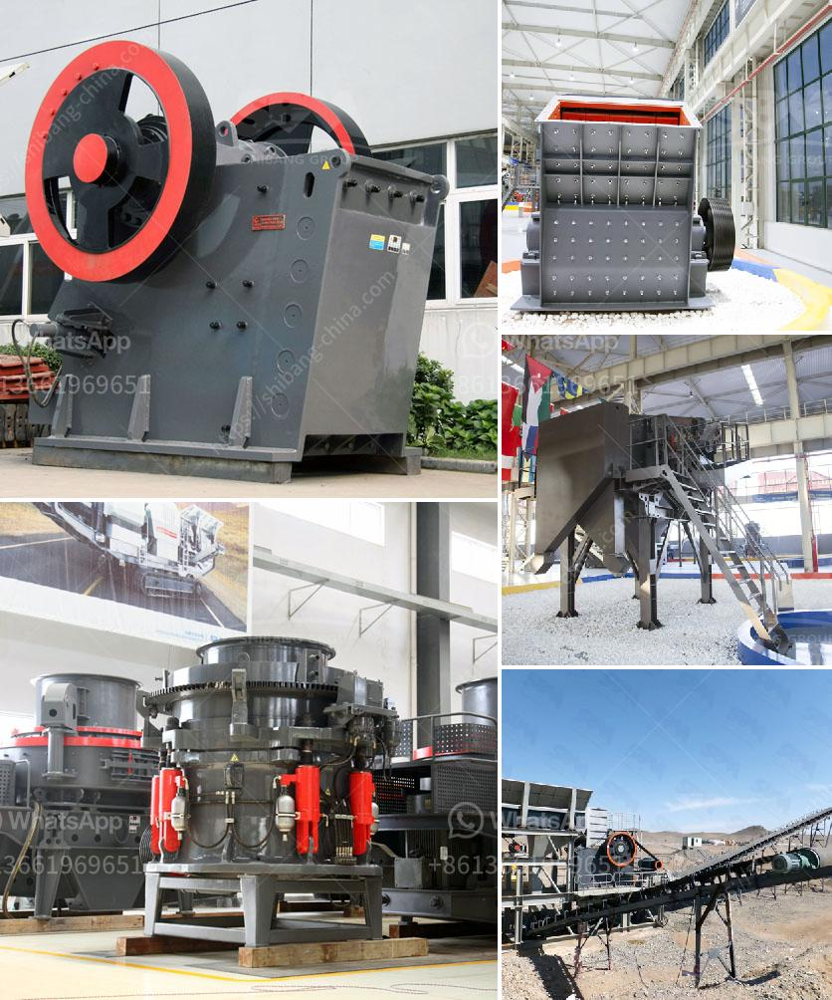

<h3>used industrial gravel making equipment</h3>
In the construction and mining industries, the need for high-quality gravel and aggregates cannot be overstated. These materials are essential for building roads, bridges, buildings, and many other structures that form the backbone of our infrastructure. To meet this demand, the market for gravel making equipment has been constantly evolving, offering innovative solutions to produce gravel efficiently and sustainably.

However, acquiring brand-new industrial gravel making equipment can be a significant investment, especially for smaller businesses or those facing budget constraints. Fortunately, used industrial gravel making equipment offers an economic and sustainable alternative. 

Used equipment has several advantages. First of all, it comes at a lower cost compared to purchasing new machinery. This means that businesses can save a significant amount of money, which can be allocated for other essential resources or expanding operations. Moreover, by purchasing used equipment, companies can acquire machinery that has been well-maintained and still offers many years of reliable service.

Choosing used industrial gravel making equipment also promotes sustainability. By giving a second life to machinery that is still capable of functioning effectively, companies can reduce waste and minimize their environmental impact. Extending the lifespan of equipment through reuse aligns with the principles of the circular economy, where resources are maximized, and waste is minimized.

Furthermore, investing in used equipment can provide businesses with the opportunity to upgrade their capabilities. As technology advances, older machinery may lack the efficiency and features of newer models. By purchasing used equipment, companies can access higher-performing models at a fraction of the cost, enabling them to improve their productivity and competitiveness.

While purchasing used industrial gravel making equipment offers numerous benefits, it is essential to consider a few key factors. Businesses should ensure that the machinery is in good working condition and meets their specific production requirements. Additionally, it is advisable to source from reputable sellers or dealers who can provide information on the equipment's history and maintenance record.

In conclusion, opting for used industrial gravel making equipment is a smart choice for businesses that require high-quality gravel and aggregates for construction and mining purposes. By offering an economical and sustainable solution, used machinery allows companies to maximize their resources, reduce costs, and contribute to environmental conservation. With the right research and due diligence, acquiring used equipment can be a wise investment that benefits both businesses and the planet.
<h3>Contact us</h3><ul><li><strong>Whatsapp:&nbsp;<a href="https://wa.me/8613661969651">+8613661969651</a></strong></li><li><a href="https://swt.shibang-china.com/?git&amp;zhl&amp;used industrial gravel making equipment"><strong>Online Service(chat now)</strong></a></li></ul><h3>Related</h3><ul><li><a href='lime and dolomite crusher plant.md'>lime and dolomite crusher plant</a></li><li><a href='used ball mill south africa.md'>used ball mill south africa</a></li><li><a href='sand washing machine price.md'>sand washing machine price</a></li><li><a href='coal processing plants.md'>coal processing plants</a></li><li><a href='fine grinding mills.md'>fine grinding mills</a></li></ul>