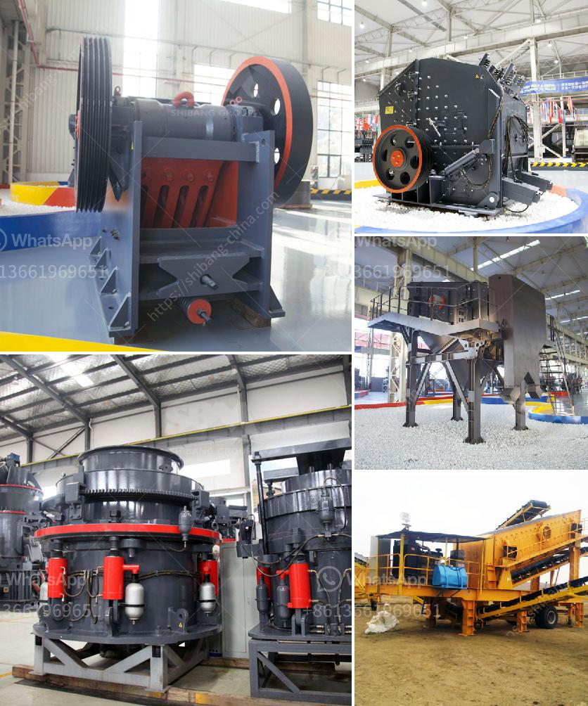

<h3>used jaw crushers from oman</h3>
When it comes to construction projects, having the right equipment is crucial. And one of the most essential pieces of equipment for any construction site is a jaw crusher. Jaw crushers are designed to crush large rocks into smaller particles, making it easier to transport and process them. If you are in Oman and looking for reliable and cost-effective jaw crushers, you're in luck!

Used jaw crushers from Oman offer a great solution for construction companies considering budget constraints. These crushers provide the same efficiency and reliability as new ones but at a fraction of the cost. Whether you need a primary crusher for initial size reduction or a secondary crusher for final processing, used jaw crushers can meet your requirements.

There are several benefits to purchasing used jaw crushers in Oman. Firstly, it helps you save money. Buying used equipment is typically more affordable than buying new. By investing in used jaw crushers, you can allocate your budget to other essential aspects of your project without compromising on quality.

Secondly, used jaw crushers offer quick availability. Waiting for a new crusher to be delivered can delay your construction project, causing unwanted downtime and financial losses. With used jaw crushers, you can take advantage of their immediate availability and start working right away.

Thirdly, used jaw crushers from Oman are known for their reliability and durability. Unlike cheap imitations, used crushers offer superior performance and are built to last. These machines have undergone rigorous inspections and testing to ensure they are in excellent working condition.

Lastly, used jaw crushers provide versatility. They can handle a wide range of materials, from soft limestone to hard granite. You can adjust the jaw crusher's settings to achieve the desired particle size and produce various types of aggregates, making them suitable for different construction applications.

In conclusion, used jaw crushers from Oman are the ideal choice for construction companies seeking reliable and cost-effective equipment. With their affordability, quick availability, reliability, durability, and versatility, used jaw crushers can help you complete your construction projects efficiently and on time. Don't let budget constraints hinder your progress – invest in used jaw crushers and experience their numerous benefits firsthand.
<h3>Contact us</h3><ul><li><strong>Whatsapp:&nbsp;<a href="https://wa.me/8613661969651">+8613661969651</a></strong></li><li><a href="https://swt.shibang-china.com/?git&amp;zhl&amp;used jaw crushers from oman"><strong>Online Service(chat now)</strong></a></li></ul><h3>Related</h3><ul><li><a href='crushing plant in the philippines.md'>crushing plant in the philippines</a></li><li><a href='prices of stone crushers in philippines.md'>prices of stone crushers in philippines</a></li><li><a href='gypsum powder machine for sale.md'>gypsum powder machine for sale</a></li><li><a href='europe used grinding equipment.md'>europe used grinding equipment</a></li><li><a href='stone crushers for sale uk finance.md'>stone crushers for sale uk finance</a></li></ul>