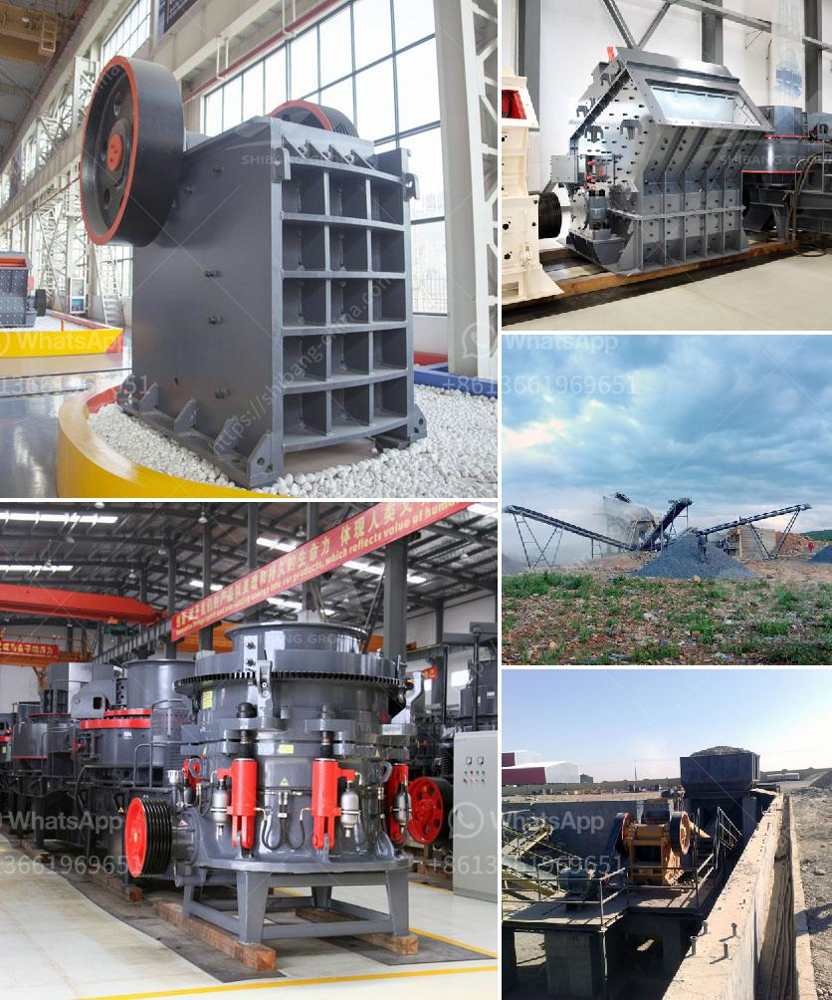

<h3>used mine equipment price</h3>
The mining industry relies heavily on robust, well-maintained equipment to ensure the successful extraction of precious resources. However, as mines evolve and technology progresses, the need for upgrading or replacing equipment arises. This presents a unique opportunity for businesses looking to invest in used mine equipment, as the prices can be significantly lower compared to brand-new machinery. Understanding the factors that influence the price of used mine equipment can help buyers make informed decisions and unlock value for their operations.

The primary factor influencing the price of used mine equipment is its age and condition. Older machinery tends to have a lower price tag, as its usage time and potential wear and tear may reduce its operational efficiency. Conversely, well-maintained equipment in excellent condition, even if older, can command a higher price due to its longevity and dependable performance. Buyers must assess the state of the equipment carefully, considering factors such as maintenance records, previous usage, and any necessary repairs or refurbishments.

Different mines have unique requirements for equipment specifications. The price of used mine equipment depends on whether it meets these specifications or can be modified to do so. Machinery that closely matches a buyer's requirements will generally be priced higher due to its suitability and reduced need for modifications. Conversely, equipment that requires extensive modifications to fit specific needs will likely have a lower price, as it incurs additional costs and downtime.

The reputation and brand value associated with used mine equipment can significantly impact its price. Well-known brands renowned for reliability and durability tend to have higher market demand, leading to higher prices. These brands often have a proven track record in the mining industry, giving buyers confidence in their investment. Lesser-known or generic brands might have lower prices but could come with a higher risk as they may lack the reliability and after-sales support of established manufacturers.

The demand and supply dynamics in the used equipment market can influence prices. In times of high mining activity and strong demand, prices for used mine equipment may rise due to limited availability. Conversely, during periods of economic downturn or reduced mining operations, prices might be more competitive as sellers attempt to move inventory. Staying informed about market conditions and timing purchases accordingly can help buyers maximize their budget and secure better deals.

Specialized features or customizations present in the used mine equipment can affect its pricing. Equipment with unique or upgraded features that enhance productivity, safety, or efficiency often command higher prices. Similarly, customizations specifically tailored to a buyer's requirements can add value to the equipment. Buyers should evaluate the relevance and usefulness of any additional features to determine their worth and impact on the price.

When considering used mine equipment, several factors come into play when determining its price. Understanding the age, condition, specifications, brand reputation, market conditions, and additional features of the machinery is essential in making an informed decision. By carefully assessing these factors, buyers can strike a balance between cost and quality, obtaining reliable equipment that meets their specific mining needs while unlocking significant value for their operations.
<h3>Contact us</h3><ul><li><strong>Whatsapp:&nbsp;<a href="https://wa.me/8613661969651">+8613661969651</a></strong></li><li><a href="https://swt.shibang-china.com/?git&amp;zhl&amp;used mine equipment price"><strong>Online Service(chat now)</strong></a></li></ul><h3>Related</h3><ul><li><a href='fly ash grinding.md'>fly ash grinding</a></li><li><a href='rock crusher machine for sale.md'>rock crusher machine for sale</a></li><li><a href='sell european stone crusher.md'>sell european stone crusher</a></li><li><a href='plans for making a miniature jaw crusher.md'>plans for making a miniature jaw crusher</a></li><li><a href='working of hydraulic circuit for milling machine.md'>working of hydraulic circuit for milling machine</a></li></ul>