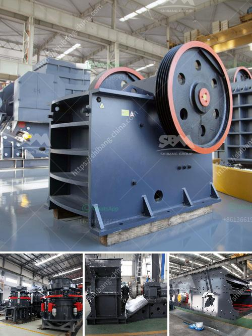

<h3>used portable crusher plant for sale dubai</h3>
Used portable crusher plant for sale in Dubai is a wise investment! Besides the renowned benefits of a new system, it offers real convenience, flexibility, and opportunities to get the job done efficiently. The used crusher plant in Dubai is the ideal choice for small to medium-sized operators.

Cumulative utilization population in the diesel generator market in the UAE, not only in Dubai, but also in the UAE, is growing rapidly. Cumulative installed capacity of generators in the UAE, according to data, reached 4.8 GW in 2020 and is expected to reach 5.1 GW in 2021. With the increase in demand, generator rentals have become common for construction projects, events, and emergency power backup. Hence, there is a rising market for portable crusher plants in Dubai.

The significant advantage of a portable crusher plant is its ability to be moved around, so if you need to transport the crusher to another site, you can do so without any trouble. These plants are easy to transport and compact, making them highly efficient for moving around construction sites. Moreover, with limited access to some areas, a portable crusher plant enables you to crush materials directly on-site, eliminating the need to transport these materials to a fixed crushing plant.

A used portable crusher plant for sale Dubai involves the use of low waste technology, and this ensures that leftover concrete from crushing remains recyclable, and usable for future construction activities. Waste crushers in Dubai can extract valuable materials such as metals and concrete for recycling purposes. Additionally, it generates less dust and noise pollution, making it environmentally friendly and comfortable for nearby residents.

Used portable crusher plant for sale in Dubai not only gives you the opportunity of reducing transportation costs but also encourages you to select material from a demolition site and break it up into specific particle sizes to meet the requirements of your upcoming project. It allows you to recycle waste materials and create a high-quality aggregate product for resale.

Besides these benefits, a used portable crusher plant for sale in Dubai becomes an attractive option for businesses as it:

2. Reduces maintenance costs – used systems are often well-maintained and have been taken care of by their previous owners

3. Increases productivity – by providing an efficient and versatile solution to your crushing operations

4. Enables job completion within set deadlines – with on-site crushing available, there is no need to rely on external crushing services

5. Offers flexibility – you can easily switch between different crushing sites and adjust the size and type of materials to be crushed.

To sum it up, a used portable crusher plant for sale Dubai not only creates economic significance for the users but also helps to contribute towards the sustainable development of the UAE. With the rapid growth projected in the generator market in the UAE, there is an increasing demand for portable crushers that are flexible, efficient, and capable of providing high-quality material for various construction purposes. So why not take advantage of the opportunity and invest in a used portable crusher plant for your projects in Dubai?
<h3>Contact us</h3><ul><li><strong>Whatsapp:&nbsp;<a href="https://wa.me/8613661969651">+8613661969651</a></strong></li><li><a href="https://swt.shibang-china.com/?git&amp;zhl&amp;used portable crusher plant for sale dubai"><strong>Online Service(chat now)</strong></a></li></ul><h3>Related</h3><ul><li><a href='company profile for suppliers of mining equipment.md'>company profile for suppliers of mining equipment</a></li><li><a href='concrete crusher for rent michigan.md'>concrete crusher for rent michigan</a></li><li><a href='hammer mill technical.md'>hammer mill technical</a></li><li><a href='prices for granite crushers.md'>prices for granite crushers</a></li><li><a href='grinding machine manufacturers ethiopia.md'>grinding machine manufacturers ethiopia</a></li></ul>