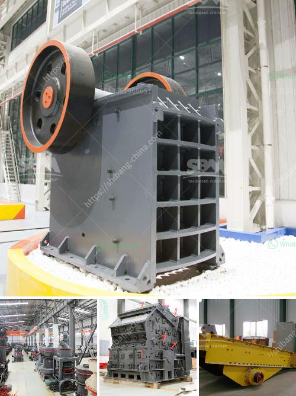

<h3>used portable roller crushers and screens</h3>
In today's fast-paced world, efficiency and mobility are key factors in any industrial operation. When it comes to crushing and screening materials, the need for flexibility and portability becomes even more crucial. Portable roller crushers and screens are the ideal solution for businesses that require on-the-go crushing capabilities.

A portable roller crusher and screen is a machine designed to take massive rocks and reduce them to smaller rocks, gravel, or rock dust. These crushers efficiently process materials, providing high-quality end products, making them ideal for industries such as mining, construction, and recycling.

One of the key advantages of portable roller crushers and screens is their mobility. Unlike fixed crushers, which require a foundation and installation, portable crushers can be easily transported from one site to another, allowing for quick and efficient setup. Whether it's a remote construction site or a quarry in a hard-to-reach location, these portable machines offer a flexible crushing solution.

Another significant advantage of portable roller crushers and screens is their versatility. These machines can process various types of materials, including concrete, asphalt, aggregates, and more. They can handle both primary and secondary crushing, making them suitable for a wide range of applications. Additionally, portable crushers can be equipped with different screening options, allowing for the production of various sized materials.

One of the main components of a portable roller crusher and screen is the roller system. The rollers, or drums, provide the necessary force to crush the materials, reducing them to the desired size. These rollers are usually equipped with teeth or spikes, enhancing the crushing efficiency. The screen system, on the other hand, separates the crushed materials based on their size. This ensures that the final product meets the specific requirements of the application.

When considering used portable roller crushers and screens, there are a few key factors to keep in mind. Firstly, it's essential to assess the condition of the machinery thoroughly. Look for signs of wear and tear, and ensure that all components are working correctly. Secondly, check the hours of operation. Lower hours indicate less wear and a longer lifespan for the equipment. Lastly, consider the maintenance history. Regular maintenance ensures that the machine is in optimal condition and minimizes the risk of unexpected breakdowns.

Investing in used portable roller crushers and screens can be a cost-effective solution for businesses. These machines often come at a lower price compared to new equipment, allowing companies to save on upfront costs. However, it's crucial to buy from reputable dealers or sellers to ensure the quality and reliability of the equipment.

In conclusion, used portable roller crushers and screens offer an efficient and flexible solution for on-the-go crushing. Their mobility and versatility make them perfect for various industries, from mining to construction. Before purchasing used equipment, it's important to evaluate its condition, hours of operation, and maintenance history. By making a wise investment in these machines, businesses can enhance their productivity and maximize their return on investment.
<h3>Contact us</h3><ul><li><strong>Whatsapp:&nbsp;<a href="https://wa.me/8613661969651">+8613661969651</a></strong></li><li><a href="https://swt.shibang-china.com/?git&amp;zhl&amp;used portable roller crushers and screens"><strong>Online Service(chat now)</strong></a></li></ul><h3>Related</h3><ul><li><a href='quarry crusher mine stone.md'>quarry crusher mine stone</a></li><li><a href='gold crusher in south africa.md'>gold crusher in south africa</a></li><li><a href='mobile rock crusher bend oregon.md'>mobile rock crusher bend oregon</a></li><li><a href='mobile crushing machines.md'>mobile crushing machines</a></li><li><a href='raymond bowl coal mill drawings.md'>raymond bowl coal mill drawings</a></li></ul>