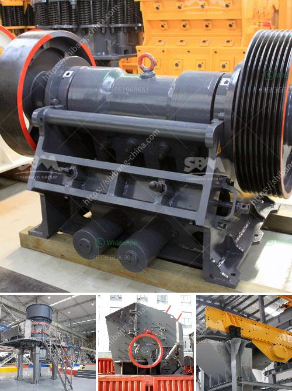

<h3>used pulverizer ball mill india</h3>
In the field of grinding and blending materials, the use of pulverizer ball mills is one of the efficient methods to achieve the desired fineness. However, buying such equipment can be a costly affair, especially for small and medium-scale industries. This is where used pulverizer ball mills in India come into play, providing a reliable and cost-effective solution.

A pulverizer ball mill is a cylindrical device that is used to grind raw materials into extremely fine powder for use in mineral dressing processes, paints, pyrotechnics, ceramics, and selective laser sintering. These mills are highly efficient as they are designed to intensely grind materials and turn them into a powder-like substance.

One of the key advantages of opting for a used ball mill pulverizer in India is that it allows industries to acquire high-quality equipment at a fraction of the original cost. With the availability of used mills, businesses can ensure that their manufacturing processes continue uninterrupted, without a significant dent in their budgets.

Additionally, used pulverizer ball mills offer a wide range of customization options to meet specific operational requirements. Industries can choose from a variety of sizes, capacities, and specifications that best suit their needs. This flexibility enables businesses to integrate the equipment seamlessly into their existing production lines.

Moreover, opting for a used pulverizer ball mill in India has environmental benefits as well. By opting for a second-hand piece of equipment, businesses contribute to reducing industrial waste and promote a circular economy. Rather than discarding functional equipment, which would end up in landfills, it can be refurbished, extending its lifespan and usability.

While purchasing used equipment has several advantages, it is crucial for businesses to exercise caution and ensure the equipment is in good working condition. Working with reputable suppliers or sellers who have a track record of selling reliable equipment is highly recommended. Buyers should inspect the used pulverizer ball mill carefully and test it before finalizing the purchase to ensure that the equipment meets their quality and performance requirements.

India has a vast marketplace for used industrial equipment, and finding a suitable used pulverizer ball mill should not be a daunting task. Online industrial equipment marketplaces, auctions, and local dealers can be valuable resources for businesses looking for high-quality used equipment.

In conclusion, used pulverizer ball mills in India offer an affordable and reliable solution for grinding and blending materials. They provide businesses with the opportunity to acquire top-quality equipment at a fraction of the original cost, while also contributing to environmental sustainability. However, buyers should exercise caution and ensure that the equipment is in good working condition before making a purchase. By leveraging the vast marketplace of used industrial equipment in India, businesses can efficiently meet their operational requirements without compromising on quality.
<h3>Contact us</h3><ul><li><strong>Whatsapp:&nbsp;<a href="https://wa.me/8613661969651">+8613661969651</a></strong></li><li><a href="https://swt.shibang-china.com/?git&amp;zhl&amp;used pulverizer ball mill india"><strong>Online Service(chat now)</strong></a></li></ul><h3>Related</h3><ul><li><a href='crushing stone crusher in spinal.md'>crushing stone crusher in spinal</a></li><li><a href='ball mill in china.md'>ball mill in china</a></li><li><a href='jaw crusher 24x12 price.md'>jaw crusher 24x12 price</a></li><li><a href='silica sand pulverizer.md'>silica sand pulverizer</a></li><li><a href='gold ore processing equipment in south africa.md'>gold ore processing equipment in south africa</a></li></ul>