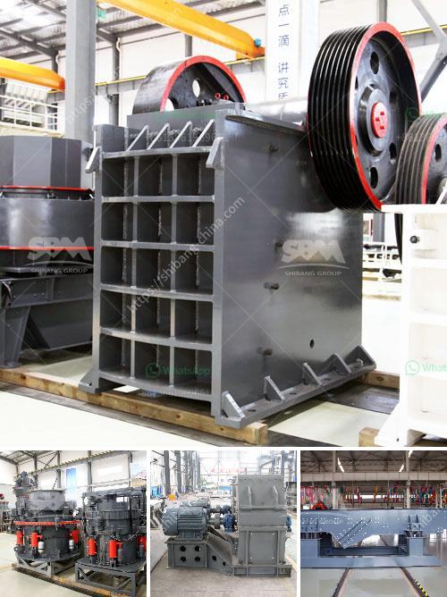

<h3>used quarry equipment for sale in calgary canada</h3>
If you are in the market for used quarry equipment for sale in Calgary, Canada, there is always a possibility that you might find just the right equipment that suits your needs. Quarrying operations, whether small or large-scale, require a wide variety of equipment to efficiently extract and process materials such as limestone, rocks, sand, gravel, and other aggregates. Finding used equipment can be a cost-effective option, particularly for those starting or expanding their quarry operations.

Calgary, being a major city in Canada and located in the province of Alberta, offers an active market for used quarry equipment. There are several factors to consider when looking for equipment, such as the type of machinery required, its condition, age, availability of spare parts, and of course, your budget.

One of the advantages of purchasing used quarry equipment is cost savings. Used equipment is typically priced significantly lower compared to brand-new machinery. This allows quarry operators to invest in more machinery or allocate the savings toward other areas of their operations. However, it is important to thoroughly inspect the equipment and assess its condition to ensure its reliability and longevity.

Thankfully, Calgary has a thriving market for used quarry equipment, with various dealers and suppliers offering a wide range of machinery for sale. It is advisable to consult with knowledgeable experts who can guide you through the process and help you make the right decision. They can provide valuable insights, assist with equipment selection, and ensure that you find the best equipment within your budget.

When purchasing used quarry equipment, it is also essential to consider the availability of spare parts. Quarry machinery is subjected to heavy wear and tear, and at some point, you may need to replace certain components. Ensuring that spare parts are readily available can save you valuable time and money in the long run.

In conclusion, Calgary, Canada offers ample opportunities to find used quarry equipment. With the proper research, expert guidance, and careful assessment of the equipment's condition and availability of spare parts, you can acquire suitable machinery to meet your quarrying needs. Remember to prioritize cost savings, efficiency, and reliability to ensure a successful and productive quarry operation.
<h3>Contact us</h3><ul><li><strong>Whatsapp:&nbsp;<a href="https://wa.me/8613661969651">+8613661969651</a></strong></li><li><a href="https://swt.shibang-china.com/?git&amp;zhl&amp;used quarry equipment for sale in calgary canada"><strong>Online Service(chat now)</strong></a></li></ul><h3>Related</h3><ul><li><a href='hammer for crushing concrete.md'>hammer for crushing concrete</a></li><li><a href='quartz silica pulverizer machine.md'>quartz silica pulverizer machine</a></li><li><a href='grinding of copper ores.md'>grinding of copper ores</a></li><li><a href='limestone crusher machine price.md'>limestone crusher machine price</a></li><li><a href='limestone rock crusher.md'>limestone rock +crusher</a></li></ul>