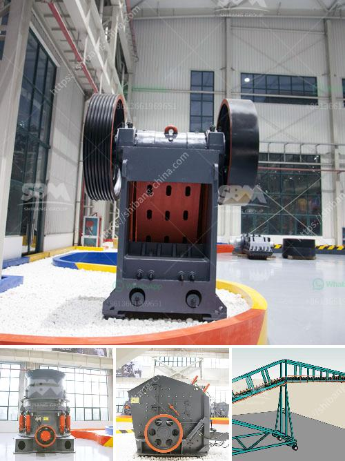

<h3>used quarry equipment from usa</h3>
The quarrying industry plays a crucial role in the construction and infrastructure sectors, ensuring the steady supply of raw materials needed to build roads, bridges, buildings, and more. As the demand for these materials continues to grow, quarry operators are always on the lookout for cost-effective solutions that can enhance their operations' efficiency and productivity. One such solution is investing in used quarry equipment from the United States.

The United States is renowned for its advanced and innovative machinery industries. With a strong focus on developing cutting-edge equipment, the country produces high-quality machines that have proven to withstand the harsh demands of quarrying operations. Consequently, there is a substantial supply of used quarry equipment available in the market, offering an excellent opportunity for businesses to acquire machinery at a lower cost while maintaining high performance standards.

One of the primary advantages of investing in used quarry equipment is affordability. New equipment can be prohibitively expensive, especially for small to medium-sized quarry operators with constrained budgets. Opting for used machinery allows these businesses to access top-of-the-line equipment at a fraction of the cost, freeing up capital to be allocated to other essential areas of their operations.

Furthermore, used quarry equipment from the USA is often well-maintained and in good condition due to the significant investment in equipment maintenance and repairs made by previous owners. Before being sold, the equipment undergoes thorough inspections and reconditioning, ensuring that it meets safety standards and performs optimally. This means that when quarry operators purchase used machinery, they can expect reliable performance and reduced downtime, maximizing productivity and profits.

Additionally, the availability of used quarry equipment from the United States offers a vast selection of machinery that can cater to various operational needs. Whether it's crushers, conveyors, loaders, or excavators, quarry operators can find the right equipment to suit their specific requirements. This flexibility allows businesses to enhance their operations and streamline their processes, ultimately improving their competitiveness in the industry.

It is essential for quarry operators to work closely with reputable equipment suppliers to ensure that the used machinery they purchase is of high quality and suitable for their operations. Trusted suppliers will have a proven track record and be knowledgeable about the intricacies of the quarrying industry. They can provide expert advice on equipment selection and offer after-sales support, including spare parts and maintenance services, ensuring that the purchased machinery continues to operate efficiently throughout its lifespan.

In conclusion, investing in used quarry equipment from the United States presents numerous benefits for quarry operators. It offers a cost-effective solution to acquire top-quality machinery while freeing up capital for other operational needs. The reliability and performance of these machines, combined with the selection available, enhance efficiency and productivity, giving businesses a competitive edge in the ever-evolving quarrying industry. By partnering with reputable equipment suppliers, quarry operators can make informed decisions and ensure that their investment yields long-term success.
<h3>Contact us</h3><ul><li><strong>Whatsapp:&nbsp;<a href="https://wa.me/8613661969651">+8613661969651</a></strong></li><li><a href="https://swt.shibang-china.com/?git&amp;zhl&amp;used quarry equipment from usa"><strong>Online Service(chat now)</strong></a></li></ul><h3>Related</h3><ul><li><a href='sell european stone crusher.md'>sell european stone crusher</a></li><li><a href='small rock crusher machine for sale.md'>small rock crusher machine for sale</a></li><li><a href='rock crushing companies.md'>rock crushing companies</a></li><li><a href='top german mining equipment manufacturers.md'>top german mining equipment manufacturers</a></li><li><a href='wet ultra fine fine grinding equipment.md'>wet ultra fine fine grinding equipment</a></li></ul>