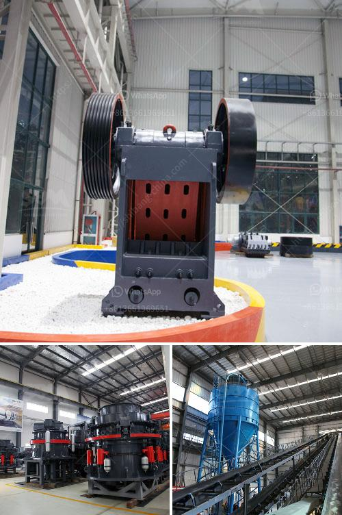

<h3>used raymond mills barite raymond mill</h3>
Barite is a non-metallic mineral commonly found in deposits around the world. It has wide-ranging industrial applications and is often used as a weighting agent in drilling muds for oil and gas exploration. Due to its importance in various industries, the demand for barite has been steadily increasing. As a result, the need for efficient processing equipment, such as Raymond mills, has also grown.

Raymond mills, also known as Raymond roller mills, are commonly used in barite processing. The machine adopts advanced structure of similar products at home and abroad, and is updated and improved on the basis of Raymond mills in the same industry. This equipment has extremely high grinding efficiency and is mainly used for grinding materials with Mohs hardness below 9.3 and humidity below 6%.

One of the key advantages of using Raymond mills for processing barite is the low cost of operation. The Raymond mill is mainly composed of a host machine, an analyzer, a fan, a finished product cyclone separator, a fine powder cyclone separator, and an air duct. Its main features are low electricity consumption and low working noise. Therefore, it is an ideal equipment for barite powder processing.

In addition to its low cost of operation, the Raymond mill also has other advantages. Firstly, it has a high degree of automation, which reduces labor costs. The fineness of the finished product can be adjusted between 80-400 mesh, ensuring that the user can obtain the desired product size. Secondly, the Raymond mill has a compact structure, occupying a small footprint. This makes it easier to install and transport, and saves a considerable amount of space. Lastly, the Raymond mill has a large production capacity, allowing it to process a large amount of barite in a short period of time.

Used Raymond mills offer numerous benefits, especially for those on a budget. By purchasing a used Raymond mill, users can save a significant amount of money compared to buying a new one. Moreover, used machinery allows for immediate availability, reducing downtime and ensuring uninterrupted production. Many companies are increasingly opting for used equipment as an economical and practical solution to meet their processing needs.

However, it is important to exercise caution when purchasing used Raymond mills. Buyers should thoroughly inspect the equipment and ensure that it is in good working condition. Consulting with experts in the industry or a reputable seller can provide valuable insights and guidance.

In conclusion, barite Raymond mills have emerged as a reliable and efficient option for processing barite. With their low cost of operation and numerous advantages, they have become increasingly popular in the industry. Used Raymond mills offer a cost-effective solution for companies looking to enhance their production capabilities without compromising on quality. By investing in a used Raymond mill, businesses can unlock the full potential of barite and take their operations to new heights.
<h3>Contact us</h3><ul><li><strong>Whatsapp:&nbsp;<a href="https://wa.me/8613661969651">+8613661969651</a></strong></li><li><a href="https://swt.shibang-china.com/?git&amp;zhl&amp;used raymond mills barite raymond mill"><strong>Online Service(chat now)</strong></a></li></ul><h3>Related</h3><ul><li><a href='ethiopia with crusher for sale.md'>ethiopia with crusher for sale</a></li><li><a href='pe 600 900 primary jaw crusher.md'>pe 600 900 primary jaw crusher</a></li><li><a href='mining crusher for lateric ores cost.md'>mining crusher for lateric ores cost</a></li><li><a href='recycling of material in construction.md'>recycling of material in construction</a></li><li><a href='vertical vertical roller mill.md'>vertical vertical roller mill</a></li></ul>