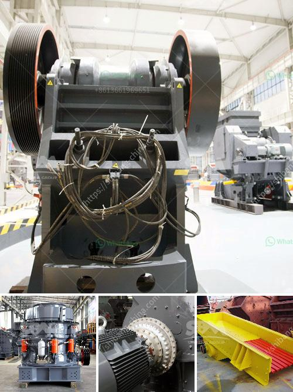

<h3>used sand mining equipment sale</h3>
Sand mining is the extraction of sand, mainly through an open pit but sometimes mined from beaches and inland dunes or dredged from ocean and river beds. Sand is often used in manufacturing, for example as an abrasive or in concrete. It is also used in landscaping and for recreational purposes, such as sandboxes and golf courses. With the increasing demand for sand, the need for efficient sand mining equipment has also grown. 

Sand mining operations can cause significant environmental damage. To minimize these impacts, certain regulations and best practices have been put in place. One such practice is the use of specialized sand mining equipment that is designed to extract sand with minimal environmental effect. However, these equipment pieces can be expensive to purchase brand new, making the option of used sand mining equipment sale an attractive alternative.

Used sand mining equipment offers a cost-effective method to mine sand and extract it for sale. It is an attractive option for suppliers who are looking to minimize upfront investment costs and still maintain high-quality equipment. Buying used equipment also gives suppliers the opportunity to upgrade or expand their operations without breaking the bank.

There are various types of sand mining equipment available in the market, depending on the specific needs of the operation. These include:

1. Dredgers: Dredgers are vessels equipped with a scoop, bucket, or suction apparatus used to remove sand from the bottom of bodies of water. Used dredgers can be modified to meet the unique requirements of sand mining operations.

2. Wash Plants: Wash plants are designed to remove dirt, clay, and other impurities from sand, leaving a clean and high-quality product. Used wash plants are an economical solution for suppliers looking to enhance the quality of their sand.

3. Screens: Screens are used to separate different-sized particles during the sand mining process. Used screens can be purchased at a fraction of the cost of new ones, enabling suppliers to save money without compromising on quality.

4. Conveyors: Conveyors are essential for transporting mined sand from one location to another. Used conveyors can be found in good working condition and are an indispensable part of any sand mining operation.

Purchasing used sand mining equipment requires careful consideration. Suppliers should thoroughly inspect the equipment to ensure that it is in good working condition. They should also take into account the history of the equipment, including past maintenance and repairs. All relevant documentation, such as service records and warranties, should be obtained to ensure a smooth and trouble-free purchase.

In conclusion, used sand mining equipment sale offers a cost-effective solution for suppliers looking to expand or enhance their sand mining operations without incurring significant upfront costs. It is essential for buyers to thoroughly inspect the equipment and obtain all documentation to ensure a successful purchase. By opting for used equipment, suppliers can save money while still maintaining high-quality operations.
<h3>Contact us</h3><ul><li><strong>Whatsapp:&nbsp;<a href="https://wa.me/8613661969651">+8613661969651</a></strong></li><li><a href="https://swt.shibang-china.com/?git&amp;zhl&amp;used sand mining equipment sale"><strong>Online Service(chat now)</strong></a></li></ul><h3>Related</h3><ul><li><a href='purchase a small rock stone crusher in philippines.md'>purchase a small rock stone crusher in philippines</a></li><li><a href='factory price tile adhesive manufacturing plant.md'>factory price tile adhesive manufacturing plant</a></li><li><a href='stone crusher plant cost in saudi.md'>stone crusher plant cost in saudi</a></li><li><a href='portable crushing.md'>portable crushing</a></li><li><a href='calcium carbonate manufacturing plant.md'>calcium carbonate manufacturing plant</a></li></ul>