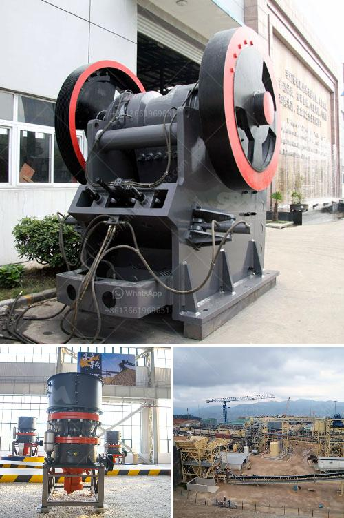

<h3>used sand screening plant for sale in uae</h3>
Are you in the construction industry and looking for an affordable yet efficient sand screening plant for your projects in the UAE? If so, you're in luck! The UAE has a thriving construction sector, and there are many used sand screening plants available for sale that can meet your specific needs.

Sand screening plants are essential in the construction industry as they help separate different sizes of sand particles, ensuring quality control and consistency in your projects. Whether you're building roads, bridges, or commercial structures, having a reliable sand screening plant can make a significant difference in the overall quality of your work.

One of the advantages of purchasing a used sand screening plant in the UAE is the cost savings. Used equipment is often more affordable than purchasing brand new, and with proper maintenance, it can deliver excellent performance for years to come. By opting for a used sand screening plant, you can allocate your budget to other essential aspects of your construction projects.

Furthermore, the availability of used sand screening plants in the UAE provides you with a wide range of options to choose from. You can select a plant that suits your specific requirements in terms of capacity, size, and features. Some plants come with multiple screening decks, allowing you to screen different sizes of sand simultaneously, saving time and improving efficiency.

When considering purchasing a used sand screening plant, it's crucial to evaluate its condition and performance. Look for well-maintained equipment with a clean service history. Ask the seller about its maintenance routine and any repairs or replacements that have been made.

Additionally, consider the reputation and credibility of the seller. Ensure they have a good track record and positive reviews from past customers. Performing proper due diligence before making a purchase will give you peace of mind and reduce the risk of potential issues down the line.

To find used sand screening plants for sale in the UAE, you can explore various sources. Online marketplaces, such as Machinery Trader and Plant & Equipment, provide a comprehensive list of available equipment. You can browse through different listings, compare prices, and contact sellers directly for further inquiries.

Another option is to visit local dealerships or attend construction trade shows and exhibitions. These events often feature a wide array of used equipment, including sand screening plants. Here, you can engage with sellers, inspect the equipment in person, and make an informed decision based on your specific requirements.

In conclusion, if you're in the UAE's construction industry and in need of a reliable sand screening plant, considering used options can be a cost-effective solution. By purchasing a well-maintained equipment from reputable sellers, you can secure an affordable yet efficient plant that will meet your needs and ensure the quality of your projects. Take advantage of the thriving construction sector in the UAE and explore the various sources available to find the perfect used sand screening plant for sale!
<h3>Contact us</h3><ul><li><strong>Whatsapp:&nbsp;<a href="https://wa.me/8613661969651">+8613661969651</a></strong></li><li><a href="https://swt.shibang-china.com/?git&amp;zhl&amp;used sand screening plant for sale in uae"><strong>Online Service(chat now)</strong></a></li></ul><h3>Related</h3><ul><li><a href='ball mills for sale.md'>ball mills for sale</a></li><li><a href='magnetic separator equipment for sale.md'>magnetic separator equipment for sale</a></li><li><a href='to see vibrating screens.md'>to see vibrating screens</a></li><li><a href='vibrating screen indonesia.md'>vibrating screen indonesia</a></li><li><a href='sample business plan for gold mine.md'>sample business plan for gold mine</a></li></ul>