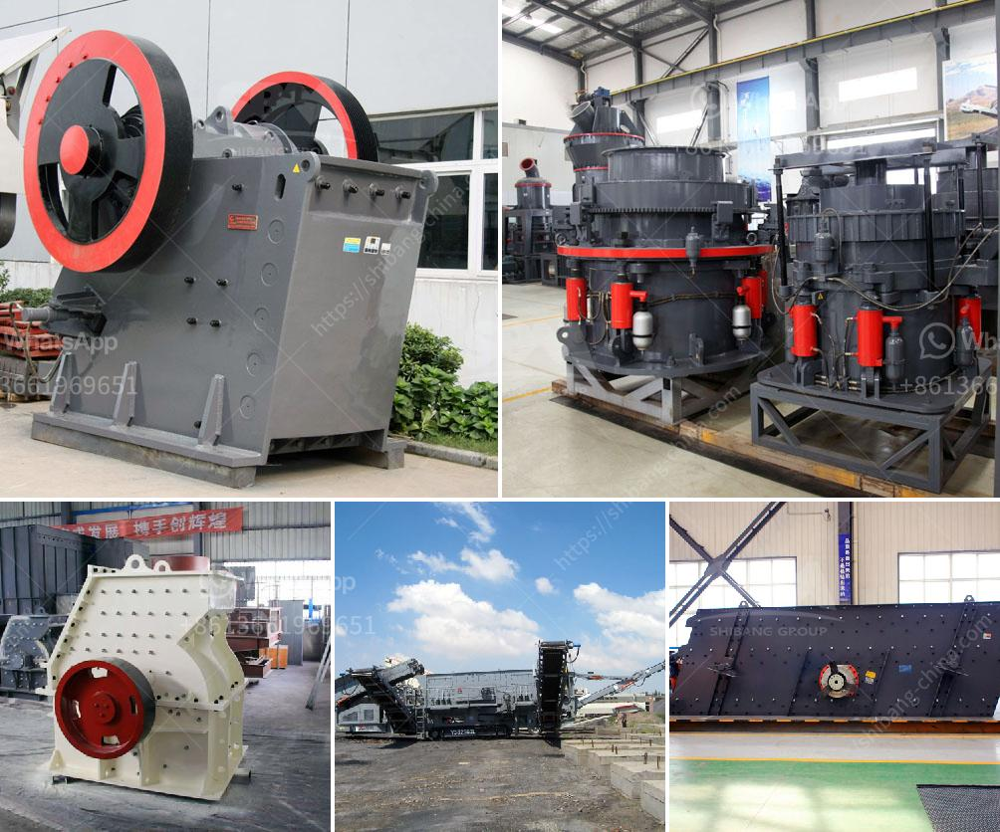

<h3>used stone crusher equipment price uk</h3>
Stone crushing industry is an important industrial sector in many countries, engaged in producing crushed stone of various sizes depending upon the requirement which acts as raw material for various construction activities such as construction of roads, highways, bridges, buildings, canals etc. It is estimated that there are over 12,000 stone crusher units in India. The number is expected to grow further keeping in view the future plans for development of infrastructure of roads, canals and buildings that are required for overall development of the country. In India, the Stone Crushing Industry sector is estimated to have an annual turnover of Rs. 5000 crore (equivalent to over US$ 1 billion) and is therefore an economically important sector. The sector is estimated to be providing direct employment to over 500,000 people engaged in various activities such as mining, crushing plant, transportation of mined stones and crushed products etc.

There are various types of stone crusher equipment available for sale in the UK. Different crushers produce different-sized products. Various screens to grade the crushed stone are available in different sizes. Crushers with manual breaking systems are also available. Some crushers are mobile and can crush rocks as large as 16 inches. These crushers are used to break stones or rocks into smaller pieces for further processing. The materials used in the manufacturing of the crusher equipment are steel or cast iron, with manganese steel often being used for the hammer or blow bar features. Because of the high wear resistance, they are suitable for crushing hard or abrasive materials on the job site.  

The used stone crusher equipment price UK is competitive. Here are some types of stone crushers available on the market for sale.

- Cone crushers: Designed to operate as secondary, tertiary or quaternary crushers, cone crushers are capable of producing large quantities of uniformly fine crushed stone.

- Impact crushers: Available in stationary and portable configurations, impact crushers can be used in primary, secondary, or tertiary applications.

In conclusion, used stone crusher equipment price UK is a fruitful investment choice if you have an idea for mining projects. For more information about our stone crushers, please contact us.
<h3>Contact us</h3><ul><li><strong>Whatsapp:&nbsp;<a href="https://wa.me/8613661969651">+8613661969651</a></strong></li><li><a href="https://swt.shibang-china.com/?git&amp;zhl&amp;used stone crusher equipment price uk"><strong>Online Service(chat now)</strong></a></li></ul><h3>Related</h3><ul><li><a href='machinery for magnesium extracted from dolomite.md'>machinery for magnesium extracted from dolomite</a></li><li><a href='250 tph mobile stone crusher price in india.md'>250 tph mobile stone crusher price in india</a></li><li><a href='4 roller mill for stone.md'>4 roller mill for stone</a></li><li><a href='river sand mining machine for sale.md'>river sand mining machine for sale</a></li><li><a href='small stone crusher plant in india.md'>small stone crusher plant in india</a></li></ul>