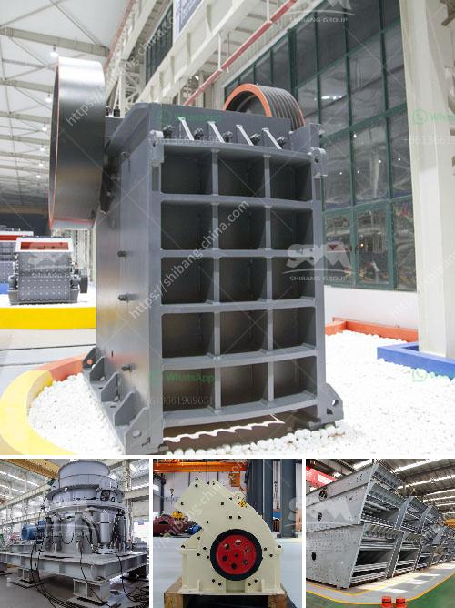

<h3>used stone crusher nigeria</h3>
Used Stone Crusher Nigeria is a necessity for the construction industry, as it provides much needed aggregates for the building and infrastructure development projects. For instance, road construction projects require tons of aggregates, as they form the base for pavement layers.

The availability of these aggregates is essential for the sustainable development of Nigeria's infrastructure. This is where the used stone crusher Nigeria comes in. This machine helps in crushing large chunks of stones into smaller pieces, making them suitable for further construction purposes.

One of the key advantages of using a used stone crusher Nigeria is the reduced cost of purchasing the machine. This is especially important for small-scale builders and contractors who may not have the financial resources to invest in a brand-new crusher. Buying a used stone crusher Nigeria allows them to save money while still getting the necessary equipment to carry out their projects.

Furthermore, a used stone crusher Nigeria is also beneficial in terms of time-saving. Instead of waiting for the delivery of a new crusher, which may take weeks or even months, contractors can immediately start using a used crusher that is readily available. This means construction projects can be completed on time, avoiding unnecessary delays.

Another advantage of a used stone crusher Nigeria is that it offers different options for crushing stones. The machine comes with different crushing chambers and settings, allowing users to customize the final product according to their specific needs. This versatility enables contractors to produce different grades of aggregates, which is crucial for various construction applications.

In addition, a used stone crusher Nigeria also helps in reducing the environmental impact of the construction industry. By reusing existing materials, such as stones, there is less demand for new resources, minimizing the extraction and processing activities associated with quarrying fresh aggregates. This results in a more sustainable and eco-friendly construction approach.

However, despite the numerous benefits of a used stone crusher Nigeria, there are also some considerations to keep in mind. Firstly, it's important to inspect the machine thoroughly before purchase to ensure it is in good working condition. This includes checking the engine, controls, and overall structure of the crusher.

Additionally, operators should also be trained to operate the machine safely and efficiently. This helps in minimizing accidents and maximizing productivity on construction sites. Regular maintenance and servicing of the used stone crusher Nigeria are also crucial to ensure its long-term performance.

In conclusion, a used stone crusher Nigeria is essential in the construction industry as it helps in the production of aggregates, which are necessary for various building and infrastructure projects. Its affordability, time-saving benefits, and versatility make it a valuable piece of equipment for contractors. However, proper inspection, maintenance, and operator training are necessary to ensure its optimal performance. With these considerations in mind, a used stone crusher Nigeria can provide significant benefits to the construction sector.
<h3>Contact us</h3><ul><li><strong>Whatsapp:&nbsp;<a href="https://wa.me/8613661969651">+8613661969651</a></strong></li><li><a href="https://swt.shibang-china.com/?git&amp;zhl&amp;used stone crusher nigeria"><strong>Online Service(chat now)</strong></a></li></ul><h3>Related</h3><ul><li><a href='sand washing machine price.md'>sand washing machine price</a></li><li><a href='gold crusher in south africa.md'>gold crusher in south africa</a></li><li><a href='gold rock crusher plant portable.md'>gold rock crusher plant portable</a></li><li><a href='manganese ore concentrate south africa.md'>manganese ore concentrate south africa</a></li><li><a href='second hand stone production line for.md'>second hand stone production line for</a></li></ul>